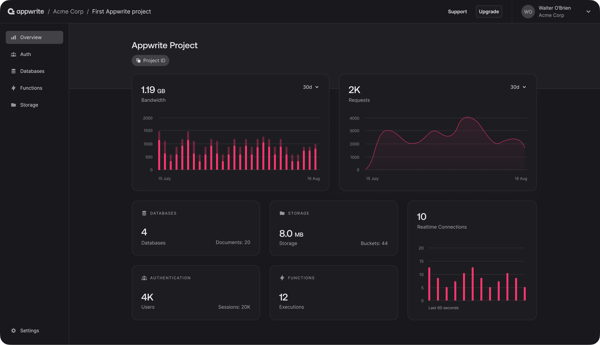

<div align="center">

[](https://appwrite.io)

# Appwrite<a id="appwrite"></a>

Appwrite backend as a service cuts up to 70% of the time and costs required for building a modern application. We abstract and simplify common development tasks behind a REST APIs, to help you develop your app in a fast and secure way. For full API documentation and tutorials go to [https://appwrite.io/docs](https://appwrite.io/docs)


</div>

## Table of Contents<a id="table-of-contents"></a>

<!-- toc -->

- [Requirements](#requirements)
- [Installation](#installation)
- [Getting Started](#getting-started)
- [Async](#async)
- [Raw HTTP Response](#raw-http-response)
- [Reference](#reference)
  * [`appwriteclient.account.add_authenticator`](#appwriteclientaccountadd_authenticator)
  * [`appwriteclient.account.block_user_status`](#appwriteclientaccountblock_user_status)
  * [`appwriteclient.account.complete_mfa_challenge`](#appwriteclientaccountcomplete_mfa_challenge)
  * [`appwriteclient.account.complete_password_recovery`](#appwriteclientaccountcomplete_password_recovery)
  * [`appwriteclient.account.confirm_phone_verification`](#appwriteclientaccountconfirm_phone_verification)
  * [`appwriteclient.account.create_anonymous_session`](#appwriteclientaccountcreate_anonymous_session)
  * [`appwriteclient.account.create_email_password_session`](#appwriteclientaccountcreate_email_password_session)
  * [`appwriteclient.account.create_email_token`](#appwriteclientaccountcreate_email_token)
  * [`appwriteclient.account.create_email_verification`](#appwriteclientaccountcreate_email_verification)
  * [`appwriteclient.account.create_email_verification_0`](#appwriteclientaccountcreate_email_verification_0)
  * [`appwriteclient.account.create_jwt`](#appwriteclientaccountcreate_jwt)
  * [`appwriteclient.account.create_magic_url_token`](#appwriteclientaccountcreate_magic_url_token)
  * [`appwriteclient.account.create_mfa_challenge`](#appwriteclientaccountcreate_mfa_challenge)
  * [`appwriteclient.account.create_mfa_recovery_codes`](#appwriteclientaccountcreate_mfa_recovery_codes)
  * [`appwriteclient.account.create_o_auth2_session`](#appwriteclientaccountcreate_o_auth2_session)
  * [`appwriteclient.account.create_o_auth2_token`](#appwriteclientaccountcreate_o_auth2_token)
  * [`appwriteclient.account.create_password_recovery`](#appwriteclientaccountcreate_password_recovery)
  * [`appwriteclient.account.create_phone_token`](#appwriteclientaccountcreate_phone_token)
  * [`appwriteclient.account.create_phone_verification`](#appwriteclientaccountcreate_phone_verification)
  * [`appwriteclient.account.create_push_target`](#appwriteclientaccountcreate_push_target)
  * [`appwriteclient.account.create_session_from_token`](#appwriteclientaccountcreate_session_from_token)
  * [`appwriteclient.account.delete_authenticator`](#appwriteclientaccountdelete_authenticator)
  * [`appwriteclient.account.delete_identity_by_id`](#appwriteclientaccountdelete_identity_by_id)
  * [`appwriteclient.account.delete_push_target`](#appwriteclientaccountdelete_push_target)
  * [`appwriteclient.account.extend_session_length`](#appwriteclientaccountextend_session_length)
  * [`appwriteclient.account.get_current_user`](#appwriteclientaccountget_current_user)
  * [`appwriteclient.account.get_mfa_recovery_codes`](#appwriteclientaccountget_mfa_recovery_codes)
  * [`appwriteclient.account.get_prefs`](#appwriteclientaccountget_prefs)
  * [`appwriteclient.account.get_session`](#appwriteclientaccountget_session)
  * [`appwriteclient.account.list_identities`](#appwriteclientaccountlist_identities)
  * [`appwriteclient.account.list_logs`](#appwriteclientaccountlist_logs)
  * [`appwriteclient.account.list_mfa_factors`](#appwriteclientaccountlist_mfa_factors)
  * [`appwriteclient.account.list_sessions`](#appwriteclientaccountlist_sessions)
  * [`appwriteclient.account.logout_session_by_id`](#appwriteclientaccountlogout_session_by_id)
  * [`appwriteclient.account.regenerate_mfa_recovery_codes`](#appwriteclientaccountregenerate_mfa_recovery_codes)
  * [`appwriteclient.account.register_user`](#appwriteclientaccountregister_user)
  * [`appwriteclient.account.remove_sessions`](#appwriteclientaccountremove_sessions)
  * [`appwriteclient.account.update_magic_url_session`](#appwriteclientaccountupdate_magic_url_session)
  * [`appwriteclient.account.update_mfa_status`](#appwriteclientaccountupdate_mfa_status)
  * [`appwriteclient.account.update_name_operation`](#appwriteclientaccountupdate_name_operation)
  * [`appwriteclient.account.update_password`](#appwriteclientaccountupdate_password)
  * [`appwriteclient.account.update_phone`](#appwriteclientaccountupdate_phone)
  * [`appwriteclient.account.update_phone_session`](#appwriteclientaccountupdate_phone_session)
  * [`appwriteclient.account.update_preferences`](#appwriteclientaccountupdate_preferences)
  * [`appwriteclient.account.update_push_target`](#appwriteclientaccountupdate_push_target)
  * [`appwriteclient.account.update_user_email`](#appwriteclientaccountupdate_user_email)
  * [`appwriteclient.account.verify_authenticator`](#appwriteclientaccountverify_authenticator)
  * [`appwriteclient.avatars.generate_qr_code_image`](#appwriteclientavatarsgenerate_qr_code_image)
  * [`appwriteclient.avatars.get_browser_icon_by_code`](#appwriteclientavatarsget_browser_icon_by_code)
  * [`appwriteclient.avatars.get_country_flag_by_code`](#appwriteclientavatarsget_country_flag_by_code)
  * [`appwriteclient.avatars.get_credit_card_icon`](#appwriteclientavatarsget_credit_card_icon)
  * [`appwriteclient.avatars.get_favicon`](#appwriteclientavatarsget_favicon)
  * [`appwriteclient.avatars.get_remote_image`](#appwriteclientavatarsget_remote_image)
  * [`appwriteclient.avatars.get_user_initials`](#appwriteclientavatarsget_user_initials)
  * [`appwriteclient.databases.create_document`](#appwriteclientdatabasescreate_document)
  * [`appwriteclient.databases.delete_document_by_id`](#appwriteclientdatabasesdelete_document_by_id)
  * [`appwriteclient.databases.get_document_by_id`](#appwriteclientdatabasesget_document_by_id)
  * [`appwriteclient.databases.list_user_documents`](#appwriteclientdatabaseslist_user_documents)
  * [`appwriteclient.databases.update_document_by_id`](#appwriteclientdatabasesupdate_document_by_id)
  * [`appwriteclient.functions.get_execution_log`](#appwriteclientfunctionsget_execution_log)
  * [`appwriteclient.functions.list_executions`](#appwriteclientfunctionslist_executions)
  * [`appwriteclient.functions.trigger_function_execution`](#appwriteclientfunctionstrigger_function_execution)
  * [`appwriteclient.graphql.execute_mutation`](#appwriteclientgraphqlexecute_mutation)
  * [`appwriteclient.graphql.execute_mutation_operation`](#appwriteclientgraphqlexecute_mutation_operation)
  * [`appwriteclient.locale.get_currencies`](#appwriteclientlocaleget_currencies)
  * [`appwriteclient.locale.get_eu_countries`](#appwriteclientlocaleget_eu_countries)
  * [`appwriteclient.locale.get_user_locale`](#appwriteclientlocaleget_user_locale)
  * [`appwriteclient.locale.list_codes`](#appwriteclientlocalelist_codes)
  * [`appwriteclient.locale.list_continents`](#appwriteclientlocalelist_continents)
  * [`appwriteclient.locale.list_countries`](#appwriteclientlocalelist_countries)
  * [`appwriteclient.locale.list_countries_phones`](#appwriteclientlocalelist_countries_phones)
  * [`appwriteclient.locale.list_languages`](#appwriteclientlocalelist_languages)
  * [`appwriteclient.messaging.add_new_subscriber`](#appwriteclientmessagingadd_new_subscriber)
  * [`appwriteclient.messaging.delete_subscriber_by_id`](#appwriteclientmessagingdelete_subscriber_by_id)
  * [`appwriteclient.storage.create_file`](#appwriteclientstoragecreate_file)
  * [`appwriteclient.storage.delete_file_by_id`](#appwriteclientstoragedelete_file_by_id)
  * [`appwriteclient.storage.get_file_by_id`](#appwriteclientstorageget_file_by_id)
  * [`appwriteclient.storage.get_file_download`](#appwriteclientstorageget_file_download)
  * [`appwriteclient.storage.get_file_for_view`](#appwriteclientstorageget_file_for_view)
  * [`appwriteclient.storage.get_file_preview_image`](#appwriteclientstorageget_file_preview_image)
  * [`appwriteclient.storage.list_files`](#appwriteclientstoragelist_files)
  * [`appwriteclient.storage.update_file_by_id`](#appwriteclientstorageupdate_file_by_id)
  * [`appwriteclient.teams.create_membership`](#appwriteclientteamscreate_membership)
  * [`appwriteclient.teams.create_new_team`](#appwriteclientteamscreate_new_team)
  * [`appwriteclient.teams.delete_membership`](#appwriteclientteamsdelete_membership)
  * [`appwriteclient.teams.get_by_id`](#appwriteclientteamsget_by_id)
  * [`appwriteclient.teams.get_membership`](#appwriteclientteamsget_membership)
  * [`appwriteclient.teams.get_prefs`](#appwriteclientteamsget_prefs)
  * [`appwriteclient.teams.get_user_memberships`](#appwriteclientteamsget_user_memberships)
  * [`appwriteclient.teams.list_memberships`](#appwriteclientteamslist_memberships)
  * [`appwriteclient.teams.remove_team`](#appwriteclientteamsremove_team)
  * [`appwriteclient.teams.update_membership_roles`](#appwriteclientteamsupdate_membership_roles)
  * [`appwriteclient.teams.update_membership_status`](#appwriteclientteamsupdate_membership_status)
  * [`appwriteclient.teams.update_name_by_id`](#appwriteclientteamsupdate_name_by_id)
  * [`appwriteclient.teams.update_prefs_by_id`](#appwriteclientteamsupdate_prefs_by_id)

<!-- tocstop -->

## Requirements<a id="requirements"></a>

Python >=3.7

## Installation<a id="installation"></a>
<div align="center">
  <a href="https://konfigthis.com/sdk-sign-up?company=Appwrite&serviceName=Client&language=Python">
    
  </a>
</div>

## Getting Started<a id="getting-started"></a>

```python
from pprint import pprint
from appwrite_client_python_sdk import AppwriteClient, ApiException

appwriteclient = AppwriteClient(
    jwt="YOUR_API_KEY",
    project="YOUR_API_KEY",
    session="YOUR_API_KEY",
)

try:
    # Add Authenticator
    add_authenticator_response = appwriteclient.account.add_authenticator(
        type="totp",
    )
    print(add_authenticator_response)
except ApiException as e:
    print("Exception when calling AccountApi.add_authenticator: %s\n" % e)
    pprint(e.body)
    pprint(e.headers)
    pprint(e.status)
    pprint(e.reason)
    pprint(e.round_trip_time)
```

## Async<a id="async"></a>

`async` support is available by prepending `a` to any method.

```python
import asyncio
from pprint import pprint
from appwrite_client_python_sdk import AppwriteClient, ApiException

appwriteclient = AppwriteClient(
    jwt="YOUR_API_KEY",
    project="YOUR_API_KEY",
    session="YOUR_API_KEY",
)


async def main():
    try:
        # Add Authenticator
        add_authenticator_response = await appwriteclient.account.aadd_authenticator(
            type="totp",
        )
        print(add_authenticator_response)
    except ApiException as e:
        print("Exception when calling AccountApi.add_authenticator: %s\n" % e)
        pprint(e.body)
        pprint(e.headers)
        pprint(e.status)
        pprint(e.reason)
        pprint(e.round_trip_time)


asyncio.run(main())
```

## Raw HTTP Response<a id="raw-http-response"></a>

To access raw HTTP response values, use the `.raw` namespace.

```python
from pprint import pprint
from appwrite_client_python_sdk import AppwriteClient, ApiException

appwriteclient = AppwriteClient(
    jwt="YOUR_API_KEY",
    project="YOUR_API_KEY",
    session="YOUR_API_KEY",
)

try:
    # Add Authenticator
    add_authenticator_response = appwriteclient.account.raw.add_authenticator(
        type="totp",
    )
    pprint(add_authenticator_response.body)
    pprint(add_authenticator_response.body["secret"])
    pprint(add_authenticator_response.body["uri"])
    pprint(add_authenticator_response.headers)
    pprint(add_authenticator_response.status)
    pprint(add_authenticator_response.round_trip_time)
except ApiException as e:
    print("Exception when calling AccountApi.add_authenticator: %s\n" % e)
    pprint(e.body)
    pprint(e.headers)
    pprint(e.status)
    pprint(e.reason)
    pprint(e.round_trip_time)
```


## Reference<a id="reference"></a>
### `appwriteclient.account.add_authenticator`<a id="appwriteclientaccountadd_authenticator"></a>

Add an authenticator app to be used as an MFA factor. Verify the authenticator using the [verify authenticator](/docs/references/cloud/client-web/account#verifyAuthenticator) method.

#### 🛠️ Usage<a id="🛠️-usage"></a>

```python
add_authenticator_response = appwriteclient.account.add_authenticator(
    type="totp",
)
```

#### ⚙️ Parameters<a id="⚙️-parameters"></a>

##### type: `str`<a id="type-str"></a>

Type of authenticator. Must be `totp`

#### 🔄 Return<a id="🔄-return"></a>

[`MfaType`](./appwrite_client_python_sdk/pydantic/mfa_type.py)

#### 🌐 Endpoint<a id="🌐-endpoint"></a>

`/account/mfa/authenticators/{type}` `post`

[🔙 **Back to Table of Contents**](#table-of-contents)

---

### `appwriteclient.account.block_user_status`<a id="appwriteclientaccountblock_user_status"></a>

Block the currently logged in user account. Behind the scene, the user record is not deleted but permanently blocked from any access. To completely delete a user, use the Users API instead.

#### 🛠️ Usage<a id="🛠️-usage"></a>

```python
block_user_status_response = appwriteclient.account.block_user_status()
```

#### 🔄 Return<a id="🔄-return"></a>

[`User`](./appwrite_client_python_sdk/pydantic/user.py)

#### 🌐 Endpoint<a id="🌐-endpoint"></a>

`/account/status` `patch`

[🔙 **Back to Table of Contents**](#table-of-contents)

---

### `appwriteclient.account.complete_mfa_challenge`<a id="appwriteclientaccountcomplete_mfa_challenge"></a>

Complete the MFA challenge by providing the one-time password. Finish the process of MFA verification by providing the one-time password. To begin the flow, use [createMfaChallenge](/docs/references/cloud/client-web/account#createMfaChallenge) method.

#### 🛠️ Usage<a id="🛠️-usage"></a>

```python
complete_mfa_challenge_response = appwriteclient.account.complete_mfa_challenge(
    challenge_id="<CHALLENGE_ID>",
    otp="<OTP>",
)
```

#### ⚙️ Parameters<a id="⚙️-parameters"></a>

##### challenge_id: `str`<a id="challenge_id-str"></a>

ID of the challenge.

##### otp: `str`<a id="otp-str"></a>

Valid verification token.

#### ⚙️ Request Body<a id="⚙️-request-body"></a>

[`AccountCompleteMfaChallengeRequest`](./appwrite_client_python_sdk/type/account_complete_mfa_challenge_request.py)
#### 🔄 Return<a id="🔄-return"></a>

[`Session`](./appwrite_client_python_sdk/pydantic/session.py)

#### 🌐 Endpoint<a id="🌐-endpoint"></a>

`/account/mfa/challenge` `put`

[🔙 **Back to Table of Contents**](#table-of-contents)

---

### `appwriteclient.account.complete_password_recovery`<a id="appwriteclientaccountcomplete_password_recovery"></a>

Use this endpoint to complete the user account password reset. Both the **userId** and **secret** arguments will be passed as query parameters to the redirect URL you have provided when sending your request to the [POST /account/recovery](https://appwrite.io/docs/references/cloud/client-web/account#createRecovery) endpoint.

Please note that in order to avoid a [Redirect Attack](https://github.com/OWASP/CheatSheetSeries/blob/master/cheatsheets/Unvalidated_Redirects_and_Forwards_Cheat_Sheet.md) the only valid redirect URLs are the ones from domains you have set when adding your platforms in the console interface.

#### 🛠️ Usage<a id="🛠️-usage"></a>

```python
complete_password_recovery_response = appwriteclient.account.complete_password_recovery(
    user_id="<USER_ID>",
    secret="<SECRET>",
    password="string_example",
)
```

#### ⚙️ Parameters<a id="⚙️-parameters"></a>

##### user_id: `str`<a id="user_id-str"></a>

User ID.

##### secret: `str`<a id="secret-str"></a>

Valid reset token.

##### password: `str`<a id="password-str"></a>

New user password. Must be between 8 and 256 chars.

#### ⚙️ Request Body<a id="⚙️-request-body"></a>

[`AccountCompletePasswordRecoveryRequest`](./appwrite_client_python_sdk/type/account_complete_password_recovery_request.py)
#### 🔄 Return<a id="🔄-return"></a>

[`Token`](./appwrite_client_python_sdk/pydantic/token.py)

#### 🌐 Endpoint<a id="🌐-endpoint"></a>

`/account/recovery` `put`

[🔙 **Back to Table of Contents**](#table-of-contents)

---

### `appwriteclient.account.confirm_phone_verification`<a id="appwriteclientaccountconfirm_phone_verification"></a>

Use this endpoint to complete the user phone verification process. Use the **userId** and **secret** that were sent to your user's phone number to verify the user email ownership. If confirmed this route will return a 200 status code.

#### 🛠️ Usage<a id="🛠️-usage"></a>

```python
confirm_phone_verification_response = appwriteclient.account.confirm_phone_verification(
    user_id="<USER_ID>",
    secret="<SECRET>",
)
```

#### ⚙️ Parameters<a id="⚙️-parameters"></a>

##### user_id: `str`<a id="user_id-str"></a>

User ID.

##### secret: `str`<a id="secret-str"></a>

Valid verification token.

#### ⚙️ Request Body<a id="⚙️-request-body"></a>

[`AccountConfirmPhoneVerificationRequest`](./appwrite_client_python_sdk/type/account_confirm_phone_verification_request.py)
#### 🔄 Return<a id="🔄-return"></a>

[`Token`](./appwrite_client_python_sdk/pydantic/token.py)

#### 🌐 Endpoint<a id="🌐-endpoint"></a>

`/account/verification/phone` `put`

[🔙 **Back to Table of Contents**](#table-of-contents)

---

### `appwriteclient.account.create_anonymous_session`<a id="appwriteclientaccountcreate_anonymous_session"></a>

Use this endpoint to allow a new user to register an anonymous account in your project. This route will also create a new session for the user. To allow the new user to convert an anonymous account to a normal account, you need to update its [email and password](https://appwrite.io/docs/references/cloud/client-web/account#updateEmail) or create an [OAuth2 session](https://appwrite.io/docs/references/cloud/client-web/account#CreateOAuth2Session).

#### 🛠️ Usage<a id="🛠️-usage"></a>

```python
create_anonymous_session_response = appwriteclient.account.create_anonymous_session()
```

#### 🔄 Return<a id="🔄-return"></a>

[`Session`](./appwrite_client_python_sdk/pydantic/session.py)

#### 🌐 Endpoint<a id="🌐-endpoint"></a>

`/account/sessions/anonymous` `post`

[🔙 **Back to Table of Contents**](#table-of-contents)

---

### `appwriteclient.account.create_email_password_session`<a id="appwriteclientaccountcreate_email_password_session"></a>

Allow the user to login into their account by providing a valid email and password combination. This route will create a new session for the user.

A user is limited to 10 active sessions at a time by default. [Learn more about session limits](https://appwrite.io/docs/authentication-security#limits).

#### 🛠️ Usage<a id="🛠️-usage"></a>

```python
create_email_password_session_response = (
    appwriteclient.account.create_email_password_session(
        email="email@example.com",
        password="password",
    )
)
```

#### ⚙️ Parameters<a id="⚙️-parameters"></a>

##### email: `str`<a id="email-str"></a>

User email.

##### password: `str`<a id="password-str"></a>

User password. Must be at least 8 chars.

#### ⚙️ Request Body<a id="⚙️-request-body"></a>

[`AccountCreateEmailPasswordSessionRequest`](./appwrite_client_python_sdk/type/account_create_email_password_session_request.py)
#### 🔄 Return<a id="🔄-return"></a>

[`Session`](./appwrite_client_python_sdk/pydantic/session.py)

#### 🌐 Endpoint<a id="🌐-endpoint"></a>

`/account/sessions/email` `post`

[🔙 **Back to Table of Contents**](#table-of-contents)

---

### `appwriteclient.account.create_email_token`<a id="appwriteclientaccountcreate_email_token"></a>

Sends the user an email with a secret key for creating a session. If the provided user ID has not be registered, a new user will be created. Use the returned user ID and secret and submit a request to the [POST /v1/account/sessions/token](https://appwrite.io/docs/references/cloud/client-web/account#createSession) endpoint to complete the login process. The secret sent to the user's email is valid for 15 minutes.

A user is limited to 10 active sessions at a time by default. [Learn more about session limits](https://appwrite.io/docs/authentication-security#limits).

#### 🛠️ Usage<a id="🛠️-usage"></a>

```python
create_email_token_response = appwriteclient.account.create_email_token(
    user_id="<USER_ID>",
    email="email@example.com",
    phrase=False,
)
```

#### ⚙️ Parameters<a id="⚙️-parameters"></a>

##### user_id: `str`<a id="user_id-str"></a>

User ID. Choose a custom ID or generate a random ID with `ID.unique()`. Valid chars are a-z, A-Z, 0-9, period, hyphen, and underscore. Can't start with a special char. Max length is 36 chars.

##### email: `str`<a id="email-str"></a>

User email.

##### phrase: `bool`<a id="phrase-bool"></a>

Toggle for security phrase. If enabled, email will be send with a randomly generated phrase and the phrase will also be included in the response. Confirming phrases match increases the security of your authentication flow.

#### ⚙️ Request Body<a id="⚙️-request-body"></a>

[`AccountCreateEmailTokenRequest`](./appwrite_client_python_sdk/type/account_create_email_token_request.py)
#### 🔄 Return<a id="🔄-return"></a>

[`Token`](./appwrite_client_python_sdk/pydantic/token.py)

#### 🌐 Endpoint<a id="🌐-endpoint"></a>

`/account/tokens/email` `post`

[🔙 **Back to Table of Contents**](#table-of-contents)

---

### `appwriteclient.account.create_email_verification`<a id="appwriteclientaccountcreate_email_verification"></a>

Use this endpoint to complete the user email verification process. Use both the **userId** and **secret** parameters that were attached to your app URL to verify the user email ownership. If confirmed this route will return a 200 status code.

#### 🛠️ Usage<a id="🛠️-usage"></a>

```python
create_email_verification_response = appwriteclient.account.create_email_verification(
    user_id="<USER_ID>",
    secret="<SECRET>",
)
```

#### ⚙️ Parameters<a id="⚙️-parameters"></a>

##### user_id: `str`<a id="user_id-str"></a>

User ID.

##### secret: `str`<a id="secret-str"></a>

Valid verification token.

#### ⚙️ Request Body<a id="⚙️-request-body"></a>

[`AccountCreateEmailVerificationRequest1`](./appwrite_client_python_sdk/type/account_create_email_verification_request1.py)
#### 🔄 Return<a id="🔄-return"></a>

[`Token`](./appwrite_client_python_sdk/pydantic/token.py)

#### 🌐 Endpoint<a id="🌐-endpoint"></a>

`/account/verification` `put`

[🔙 **Back to Table of Contents**](#table-of-contents)

---

### `appwriteclient.account.create_email_verification_0`<a id="appwriteclientaccountcreate_email_verification_0"></a>

Use this endpoint to send a verification message to your user email address to confirm they are the valid owners of that address. Both the **userId** and **secret** arguments will be passed as query parameters to the URL you have provided to be attached to the verification email. The provided URL should redirect the user back to your app and allow you to complete the verification process by verifying both the **userId** and **secret** parameters. Learn more about how to [complete the verification process](https://appwrite.io/docs/references/cloud/client-web/account#updateVerification). The verification link sent to the user's email address is valid for 7 days.

Please note that in order to avoid a [Redirect Attack](https://github.com/OWASP/CheatSheetSeries/blob/master/cheatsheets/Unvalidated_Redirects_and_Forwards_Cheat_Sheet.md), the only valid redirect URLs are the ones from domains you have set when adding your platforms in the console interface.


#### 🛠️ Usage<a id="🛠️-usage"></a>

```python
create_email_verification_0_response = (
    appwriteclient.account.create_email_verification_0(
        url="https://example.com",
    )
)
```

#### ⚙️ Parameters<a id="⚙️-parameters"></a>

##### url: `str`<a id="url-str"></a>

URL to redirect the user back to your app from the verification email. Only URLs from hostnames in your project platform list are allowed. This requirement helps to prevent an [open redirect](https://cheatsheetseries.owasp.org/cheatsheets/Unvalidated_Redirects_and_Forwards_Cheat_Sheet.html) attack against your project API.

#### ⚙️ Request Body<a id="⚙️-request-body"></a>

[`AccountCreateEmailVerificationRequest`](./appwrite_client_python_sdk/type/account_create_email_verification_request.py)
#### 🔄 Return<a id="🔄-return"></a>

[`Token`](./appwrite_client_python_sdk/pydantic/token.py)

#### 🌐 Endpoint<a id="🌐-endpoint"></a>

`/account/verification` `post`

[🔙 **Back to Table of Contents**](#table-of-contents)

---

### `appwriteclient.account.create_jwt`<a id="appwriteclientaccountcreate_jwt"></a>

Use this endpoint to create a JSON Web Token. You can use the resulting JWT to authenticate on behalf of the current user when working with the Appwrite server-side API and SDKs. The JWT secret is valid for 15 minutes from its creation and will be invalid if the user will logout in that time frame.

#### 🛠️ Usage<a id="🛠️-usage"></a>

```python
create_jwt_response = appwriteclient.account.create_jwt()
```

#### 🔄 Return<a id="🔄-return"></a>

[`Jwt`](./appwrite_client_python_sdk/pydantic/jwt.py)

#### 🌐 Endpoint<a id="🌐-endpoint"></a>

`/account/jwt` `post`

[🔙 **Back to Table of Contents**](#table-of-contents)

---

### `appwriteclient.account.create_magic_url_token`<a id="appwriteclientaccountcreate_magic_url_token"></a>

Sends the user an email with a secret key for creating a session. If the provided user ID has not been registered, a new user will be created. When the user clicks the link in the email, the user is redirected back to the URL you provided with the secret key and userId values attached to the URL query string. Use the query string parameters to submit a request to the [POST /v1/account/sessions/token](https://appwrite.io/docs/references/cloud/client-web/account#createSession) endpoint to complete the login process. The link sent to the user's email address is valid for 1 hour. If you are on a mobile device you can leave the URL parameter empty, so that the login completion will be handled by your Appwrite instance by default.

A user is limited to 10 active sessions at a time by default. [Learn more about session limits](https://appwrite.io/docs/authentication-security#limits).


#### 🛠️ Usage<a id="🛠️-usage"></a>

```python
create_magic_url_token_response = appwriteclient.account.create_magic_url_token(
    user_id="<USER_ID>",
    email="email@example.com",
    url="https://example.com",
    phrase=False,
)
```

#### ⚙️ Parameters<a id="⚙️-parameters"></a>

##### user_id: `str`<a id="user_id-str"></a>

Unique Id. Choose a custom ID or generate a random ID with `ID.unique()`. Valid chars are a-z, A-Z, 0-9, period, hyphen, and underscore. Can't start with a special char. Max length is 36 chars.

##### email: `str`<a id="email-str"></a>

User email.

##### url: `str`<a id="url-str"></a>

URL to redirect the user back to your app from the magic URL login. Only URLs from hostnames in your project platform list are allowed. This requirement helps to prevent an [open redirect](https://cheatsheetseries.owasp.org/cheatsheets/Unvalidated_Redirects_and_Forwards_Cheat_Sheet.html) attack against your project API.

##### phrase: `bool`<a id="phrase-bool"></a>

Toggle for security phrase. If enabled, email will be send with a randomly generated phrase and the phrase will also be included in the response. Confirming phrases match increases the security of your authentication flow.

#### ⚙️ Request Body<a id="⚙️-request-body"></a>

[`AccountCreateMagicUrlTokenRequest`](./appwrite_client_python_sdk/type/account_create_magic_url_token_request.py)
#### 🔄 Return<a id="🔄-return"></a>

[`Token`](./appwrite_client_python_sdk/pydantic/token.py)

#### 🌐 Endpoint<a id="🌐-endpoint"></a>

`/account/tokens/magic-url` `post`

[🔙 **Back to Table of Contents**](#table-of-contents)

---

### `appwriteclient.account.create_mfa_challenge`<a id="appwriteclientaccountcreate_mfa_challenge"></a>

Begin the process of MFA verification after sign-in. Finish the flow with [updateMfaChallenge](/docs/references/cloud/client-web/account#updateMfaChallenge) method.

#### 🛠️ Usage<a id="🛠️-usage"></a>

```python
create_mfa_challenge_response = appwriteclient.account.create_mfa_challenge(
    factor="email",
)
```

#### ⚙️ Parameters<a id="⚙️-parameters"></a>

##### factor: `str`<a id="factor-str"></a>

Factor used for verification. Must be one of following: `email`, `phone`, `totp`, `recoveryCode`.

#### ⚙️ Request Body<a id="⚙️-request-body"></a>

[`AccountCreateMfaChallengeRequest`](./appwrite_client_python_sdk/type/account_create_mfa_challenge_request.py)
#### 🔄 Return<a id="🔄-return"></a>

[`MfaChallenge`](./appwrite_client_python_sdk/pydantic/mfa_challenge.py)

#### 🌐 Endpoint<a id="🌐-endpoint"></a>

`/account/mfa/challenge` `post`

[🔙 **Back to Table of Contents**](#table-of-contents)

---

### `appwriteclient.account.create_mfa_recovery_codes`<a id="appwriteclientaccountcreate_mfa_recovery_codes"></a>

Generate recovery codes as backup for MFA flow. It's recommended to generate and show then immediately after user successfully adds their authehticator. Recovery codes can be used as a MFA verification type in [createMfaChallenge](/docs/references/cloud/client-web/account#createMfaChallenge) method.

#### 🛠️ Usage<a id="🛠️-usage"></a>

```python
create_mfa_recovery_codes_response = appwriteclient.account.create_mfa_recovery_codes()
```

#### 🔄 Return<a id="🔄-return"></a>

[`MfaRecoveryCodes`](./appwrite_client_python_sdk/pydantic/mfa_recovery_codes.py)

#### 🌐 Endpoint<a id="🌐-endpoint"></a>

`/account/mfa/recovery-codes` `post`

[🔙 **Back to Table of Contents**](#table-of-contents)

---

### `appwriteclient.account.create_o_auth2_session`<a id="appwriteclientaccountcreate_o_auth2_session"></a>

Allow the user to login to their account using the OAuth2 provider of their choice. Each OAuth2 provider should be enabled from the Appwrite console first. Use the success and failure arguments to provide a redirect URL's back to your app when login is completed.

If there is already an active session, the new session will be attached to the logged-in account. If there are no active sessions, the server will attempt to look for a user with the same email address as the email received from the OAuth2 provider and attach the new session to the existing user. If no matching user is found - the server will create a new user.

A user is limited to 10 active sessions at a time by default. [Learn more about session limits](https://appwrite.io/docs/authentication-security#limits).


#### 🛠️ Usage<a id="🛠️-usage"></a>

```python
appwriteclient.account.create_o_auth2_session(
    provider="amazon",
    success="",
    failure="",
    scopes=[],
)
```

#### ⚙️ Parameters<a id="⚙️-parameters"></a>

##### provider: `str`<a id="provider-str"></a>

OAuth2 Provider. Currently, supported providers are: amazon, apple, auth0, authentik, autodesk, bitbucket, bitly, box, dailymotion, discord, disqus, dropbox, etsy, facebook, github, gitlab, google, linkedin, microsoft, notion, oidc, okta, paypal, paypalSandbox, podio, salesforce, slack, spotify, stripe, tradeshift, tradeshiftBox, twitch, wordpress, yahoo, yammer, yandex, zoho, zoom.

##### success: `str`<a id="success-str"></a>

URL to redirect back to your app after a successful login attempt.  Only URLs from hostnames in your project's platform list are allowed. This requirement helps to prevent an [open redirect](https://cheatsheetseries.owasp.org/cheatsheets/Unvalidated_Redirects_and_Forwards_Cheat_Sheet.html) attack against your project API.

##### failure: `str`<a id="failure-str"></a>

URL to redirect back to your app after a failed login attempt.  Only URLs from hostnames in your project's platform list are allowed. This requirement helps to prevent an [open redirect](https://cheatsheetseries.owasp.org/cheatsheets/Unvalidated_Redirects_and_Forwards_Cheat_Sheet.html) attack against your project API.

##### scopes: List[`str`]<a id="scopes-liststr"></a>

A list of custom OAuth2 scopes. Check each provider internal docs for a list of supported scopes. Maximum of 100 scopes are allowed, each 4096 characters long.

#### 🌐 Endpoint<a id="🌐-endpoint"></a>

`/account/sessions/oauth2/{provider}` `get`

[🔙 **Back to Table of Contents**](#table-of-contents)

---

### `appwriteclient.account.create_o_auth2_token`<a id="appwriteclientaccountcreate_o_auth2_token"></a>

Allow the user to login to their account using the OAuth2 provider of their choice. Each OAuth2 provider should be enabled from the Appwrite console first. Use the success and failure arguments to provide a redirect URL's back to your app when login is completed. 

If authentication succeeds, `userId` and `secret` of a token will be appended to the success URL as query parameters. These can be used to create a new session using the [Create session](https://appwrite.io/docs/references/cloud/client-web/account#createSession) endpoint.

A user is limited to 10 active sessions at a time by default. [Learn more about session limits](https://appwrite.io/docs/authentication-security#limits).

#### 🛠️ Usage<a id="🛠️-usage"></a>

```python
appwriteclient.account.create_o_auth2_token(
    provider="amazon",
    success="",
    failure="",
    scopes=[],
)
```

#### ⚙️ Parameters<a id="⚙️-parameters"></a>

##### provider: `str`<a id="provider-str"></a>

OAuth2 Provider. Currently, supported providers are: amazon, apple, auth0, authentik, autodesk, bitbucket, bitly, box, dailymotion, discord, disqus, dropbox, etsy, facebook, github, gitlab, google, linkedin, microsoft, notion, oidc, okta, paypal, paypalSandbox, podio, salesforce, slack, spotify, stripe, tradeshift, tradeshiftBox, twitch, wordpress, yahoo, yammer, yandex, zoho, zoom.

##### success: `str`<a id="success-str"></a>

URL to redirect back to your app after a successful login attempt.  Only URLs from hostnames in your project's platform list are allowed. This requirement helps to prevent an [open redirect](https://cheatsheetseries.owasp.org/cheatsheets/Unvalidated_Redirects_and_Forwards_Cheat_Sheet.html) attack against your project API.

##### failure: `str`<a id="failure-str"></a>

URL to redirect back to your app after a failed login attempt.  Only URLs from hostnames in your project's platform list are allowed. This requirement helps to prevent an [open redirect](https://cheatsheetseries.owasp.org/cheatsheets/Unvalidated_Redirects_and_Forwards_Cheat_Sheet.html) attack against your project API.

##### scopes: List[`str`]<a id="scopes-liststr"></a>

A list of custom OAuth2 scopes. Check each provider internal docs for a list of supported scopes. Maximum of 100 scopes are allowed, each 4096 characters long.

#### 🌐 Endpoint<a id="🌐-endpoint"></a>

`/account/tokens/oauth2/{provider}` `get`

[🔙 **Back to Table of Contents**](#table-of-contents)

---

### `appwriteclient.account.create_password_recovery`<a id="appwriteclientaccountcreate_password_recovery"></a>

Sends the user an email with a temporary secret key for password reset. When the user clicks the confirmation link he is redirected back to your app password reset URL with the secret key and email address values attached to the URL query string. Use the query string params to submit a request to the [PUT /account/recovery](https://appwrite.io/docs/references/cloud/client-web/account#updateRecovery) endpoint to complete the process. The verification link sent to the user's email address is valid for 1 hour.

#### 🛠️ Usage<a id="🛠️-usage"></a>

```python
create_password_recovery_response = appwriteclient.account.create_password_recovery(
    email="email@example.com",
    url="https://example.com",
)
```

#### ⚙️ Parameters<a id="⚙️-parameters"></a>

##### email: `str`<a id="email-str"></a>

User email.

##### url: `str`<a id="url-str"></a>

URL to redirect the user back to your app from the recovery email. Only URLs from hostnames in your project platform list are allowed. This requirement helps to prevent an [open redirect](https://cheatsheetseries.owasp.org/cheatsheets/Unvalidated_Redirects_and_Forwards_Cheat_Sheet.html) attack against your project API.

#### ⚙️ Request Body<a id="⚙️-request-body"></a>

[`AccountCreatePasswordRecoveryRequest`](./appwrite_client_python_sdk/type/account_create_password_recovery_request.py)
#### 🔄 Return<a id="🔄-return"></a>

[`Token`](./appwrite_client_python_sdk/pydantic/token.py)

#### 🌐 Endpoint<a id="🌐-endpoint"></a>

`/account/recovery` `post`

[🔙 **Back to Table of Contents**](#table-of-contents)

---

### `appwriteclient.account.create_phone_token`<a id="appwriteclientaccountcreate_phone_token"></a>

Sends the user an SMS with a secret key for creating a session. If the provided user ID has not be registered, a new user will be created. Use the returned user ID and secret and submit a request to the [POST /v1/account/sessions/token](https://appwrite.io/docs/references/cloud/client-web/account#createSession) endpoint to complete the login process. The secret sent to the user's phone is valid for 15 minutes.

A user is limited to 10 active sessions at a time by default. [Learn more about session limits](https://appwrite.io/docs/authentication-security#limits).

#### 🛠️ Usage<a id="🛠️-usage"></a>

```python
create_phone_token_response = appwriteclient.account.create_phone_token(
    user_id="<USER_ID>",
    phone="+12065550100",
)
```

#### ⚙️ Parameters<a id="⚙️-parameters"></a>

##### user_id: `str`<a id="user_id-str"></a>

Unique Id. Choose a custom ID or generate a random ID with `ID.unique()`. Valid chars are a-z, A-Z, 0-9, period, hyphen, and underscore. Can't start with a special char. Max length is 36 chars.

##### phone: `str`<a id="phone-str"></a>

Phone number. Format this number with a leading '+' and a country code, e.g., +16175551212.

#### ⚙️ Request Body<a id="⚙️-request-body"></a>

[`AccountCreatePhoneTokenRequest`](./appwrite_client_python_sdk/type/account_create_phone_token_request.py)
#### 🔄 Return<a id="🔄-return"></a>

[`Token`](./appwrite_client_python_sdk/pydantic/token.py)

#### 🌐 Endpoint<a id="🌐-endpoint"></a>

`/account/tokens/phone` `post`

[🔙 **Back to Table of Contents**](#table-of-contents)

---

### `appwriteclient.account.create_phone_verification`<a id="appwriteclientaccountcreate_phone_verification"></a>

Use this endpoint to send a verification SMS to the currently logged in user. This endpoint is meant for use after updating a user's phone number using the [accountUpdatePhone](https://appwrite.io/docs/references/cloud/client-web/account#updatePhone) endpoint. Learn more about how to [complete the verification process](https://appwrite.io/docs/references/cloud/client-web/account#updatePhoneVerification). The verification code sent to the user's phone number is valid for 15 minutes.

#### 🛠️ Usage<a id="🛠️-usage"></a>

```python
create_phone_verification_response = appwriteclient.account.create_phone_verification()
```

#### 🔄 Return<a id="🔄-return"></a>

[`Token`](./appwrite_client_python_sdk/pydantic/token.py)

#### 🌐 Endpoint<a id="🌐-endpoint"></a>

`/account/verification/phone` `post`

[🔙 **Back to Table of Contents**](#table-of-contents)

---

### `appwriteclient.account.create_push_target`<a id="appwriteclientaccountcreate_push_target"></a>

Create push target

#### 🛠️ Usage<a id="🛠️-usage"></a>

```python
create_push_target_response = appwriteclient.account.create_push_target(
    target_id="<TARGET_ID>",
    identifier="<IDENTIFIER>",
    provider_id="<PROVIDER_ID>",
)
```

#### ⚙️ Parameters<a id="⚙️-parameters"></a>

##### target_id: `str`<a id="target_id-str"></a>

Target ID. Choose a custom ID or generate a random ID with `ID.unique()`. Valid chars are a-z, A-Z, 0-9, period, hyphen, and underscore. Can't start with a special char. Max length is 36 chars.

##### identifier: `str`<a id="identifier-str"></a>

The target identifier (token, email, phone etc.)

##### provider_id: `str`<a id="provider_id-str"></a>

Provider ID. Message will be sent to this target from the specified provider ID. If no provider ID is set the first setup provider will be used.

#### ⚙️ Request Body<a id="⚙️-request-body"></a>

[`AccountCreatePushTargetRequest`](./appwrite_client_python_sdk/type/account_create_push_target_request.py)
#### 🔄 Return<a id="🔄-return"></a>

[`Target`](./appwrite_client_python_sdk/pydantic/target.py)

#### 🌐 Endpoint<a id="🌐-endpoint"></a>

`/account/targets/push` `post`

[🔙 **Back to Table of Contents**](#table-of-contents)

---

### `appwriteclient.account.create_session_from_token`<a id="appwriteclientaccountcreate_session_from_token"></a>

Use this endpoint to create a session from token. Provide the **userId** and **secret** parameters from the successful response of authentication flows initiated by token creation. For example, magic URL and phone login.

#### 🛠️ Usage<a id="🛠️-usage"></a>

```python
create_session_from_token_response = appwriteclient.account.create_session_from_token(
    user_id="<USER_ID>",
    secret="<SECRET>",
)
```

#### ⚙️ Parameters<a id="⚙️-parameters"></a>

##### user_id: `str`<a id="user_id-str"></a>

User ID. Choose a custom ID or generate a random ID with `ID.unique()`. Valid chars are a-z, A-Z, 0-9, period, hyphen, and underscore. Can't start with a special char. Max length is 36 chars.

##### secret: `str`<a id="secret-str"></a>

Secret of a token generated by login methods. For example, the `createMagicURLToken` or `createPhoneToken` methods.

#### ⚙️ Request Body<a id="⚙️-request-body"></a>

[`AccountCreateSessionFromTokenRequest`](./appwrite_client_python_sdk/type/account_create_session_from_token_request.py)
#### 🔄 Return<a id="🔄-return"></a>

[`Session`](./appwrite_client_python_sdk/pydantic/session.py)

#### 🌐 Endpoint<a id="🌐-endpoint"></a>

`/account/sessions/token` `post`

[🔙 **Back to Table of Contents**](#table-of-contents)

---

### `appwriteclient.account.delete_authenticator`<a id="appwriteclientaccountdelete_authenticator"></a>

Delete an authenticator for a user by ID.

#### 🛠️ Usage<a id="🛠️-usage"></a>

```python
delete_authenticator_response = appwriteclient.account.delete_authenticator(
    otp="<OTP>",
    type="totp",
)
```

#### ⚙️ Parameters<a id="⚙️-parameters"></a>

##### otp: `str`<a id="otp-str"></a>

Valid verification token.

##### type: `str`<a id="type-str"></a>

Type of authenticator.

#### ⚙️ Request Body<a id="⚙️-request-body"></a>

[`AccountDeleteAuthenticatorRequest`](./appwrite_client_python_sdk/type/account_delete_authenticator_request.py)
#### 🔄 Return<a id="🔄-return"></a>

[`User`](./appwrite_client_python_sdk/pydantic/user.py)

#### 🌐 Endpoint<a id="🌐-endpoint"></a>

`/account/mfa/authenticators/{type}` `delete`

[🔙 **Back to Table of Contents**](#table-of-contents)

---

### `appwriteclient.account.delete_identity_by_id`<a id="appwriteclientaccountdelete_identity_by_id"></a>

Delete an identity by its unique ID.

#### 🛠️ Usage<a id="🛠️-usage"></a>

```python
appwriteclient.account.delete_identity_by_id(
    identity_id="identityId_example",
)
```

#### ⚙️ Parameters<a id="⚙️-parameters"></a>

##### identity_id: `str`<a id="identity_id-str"></a>

Identity ID.

#### 🌐 Endpoint<a id="🌐-endpoint"></a>

`/account/identities/{identityId}` `delete`

[🔙 **Back to Table of Contents**](#table-of-contents)

---

### `appwriteclient.account.delete_push_target`<a id="appwriteclientaccountdelete_push_target"></a>

Delete push target

#### 🛠️ Usage<a id="🛠️-usage"></a>

```python
delete_push_target_response = appwriteclient.account.delete_push_target(
    target_id="targetId_example",
)
```

#### ⚙️ Parameters<a id="⚙️-parameters"></a>

##### target_id: `str`<a id="target_id-str"></a>

Target ID.

#### 🔄 Return<a id="🔄-return"></a>

[`Target`](./appwrite_client_python_sdk/pydantic/target.py)

#### 🌐 Endpoint<a id="🌐-endpoint"></a>

`/account/targets/{targetId}/push` `delete`

[🔙 **Back to Table of Contents**](#table-of-contents)

---

### `appwriteclient.account.extend_session_length`<a id="appwriteclientaccountextend_session_length"></a>

Use this endpoint to extend a session's length. Extending a session is useful when session expiry is short. If the session was created using an OAuth provider, this endpoint refreshes the access token from the provider.

#### 🛠️ Usage<a id="🛠️-usage"></a>

```python
extend_session_length_response = appwriteclient.account.extend_session_length(
    session_id="sessionId_example",
)
```

#### ⚙️ Parameters<a id="⚙️-parameters"></a>

##### session_id: `str`<a id="session_id-str"></a>

Session ID. Use the string 'current' to update the current device session.

#### 🔄 Return<a id="🔄-return"></a>

[`Session`](./appwrite_client_python_sdk/pydantic/session.py)

#### 🌐 Endpoint<a id="🌐-endpoint"></a>

`/account/sessions/{sessionId}` `patch`

[🔙 **Back to Table of Contents**](#table-of-contents)

---

### `appwriteclient.account.get_current_user`<a id="appwriteclientaccountget_current_user"></a>

Get the currently logged in user.

#### 🛠️ Usage<a id="🛠️-usage"></a>

```python
get_current_user_response = appwriteclient.account.get_current_user()
```

#### 🔄 Return<a id="🔄-return"></a>

[`User`](./appwrite_client_python_sdk/pydantic/user.py)

#### 🌐 Endpoint<a id="🌐-endpoint"></a>

`/account` `get`

[🔙 **Back to Table of Contents**](#table-of-contents)

---

### `appwriteclient.account.get_mfa_recovery_codes`<a id="appwriteclientaccountget_mfa_recovery_codes"></a>

Get recovery codes that can be used as backup for MFA flow. Before getting codes, they must be generated using [createMfaRecoveryCodes](/docs/references/cloud/client-web/account#createMfaRecoveryCodes) method. An OTP challenge is required to read recovery codes.

#### 🛠️ Usage<a id="🛠️-usage"></a>

```python
get_mfa_recovery_codes_response = appwriteclient.account.get_mfa_recovery_codes()
```

#### 🔄 Return<a id="🔄-return"></a>

[`MfaRecoveryCodes`](./appwrite_client_python_sdk/pydantic/mfa_recovery_codes.py)

#### 🌐 Endpoint<a id="🌐-endpoint"></a>

`/account/mfa/recovery-codes` `get`

[🔙 **Back to Table of Contents**](#table-of-contents)

---

### `appwriteclient.account.get_prefs`<a id="appwriteclientaccountget_prefs"></a>

Get the preferences as a key-value object for the currently logged in user.

#### 🛠️ Usage<a id="🛠️-usage"></a>

```python
get_prefs_response = appwriteclient.account.get_prefs()
```

#### 🔄 Return<a id="🔄-return"></a>

[`Preferences`](./appwrite_client_python_sdk/pydantic/preferences.py)

#### 🌐 Endpoint<a id="🌐-endpoint"></a>

`/account/prefs` `get`

[🔙 **Back to Table of Contents**](#table-of-contents)

---

### `appwriteclient.account.get_session`<a id="appwriteclientaccountget_session"></a>

Use this endpoint to get a logged in user's session using a Session ID. Inputting 'current' will return the current session being used.

#### 🛠️ Usage<a id="🛠️-usage"></a>

```python
get_session_response = appwriteclient.account.get_session(
    session_id="sessionId_example",
)
```

#### ⚙️ Parameters<a id="⚙️-parameters"></a>

##### session_id: `str`<a id="session_id-str"></a>

Session ID. Use the string 'current' to get the current device session.

#### 🔄 Return<a id="🔄-return"></a>

[`Session`](./appwrite_client_python_sdk/pydantic/session.py)

#### 🌐 Endpoint<a id="🌐-endpoint"></a>

`/account/sessions/{sessionId}` `get`

[🔙 **Back to Table of Contents**](#table-of-contents)

---

### `appwriteclient.account.list_identities`<a id="appwriteclientaccountlist_identities"></a>

Get the list of identities for the currently logged in user.

#### 🛠️ Usage<a id="🛠️-usage"></a>

```python
list_identities_response = appwriteclient.account.list_identities(
    queries=[],
)
```

#### ⚙️ Parameters<a id="⚙️-parameters"></a>

##### queries: List[`str`]<a id="queries-liststr"></a>

Array of query strings generated using the Query class provided by the SDK. [Learn more about queries](https://appwrite.io/docs/queries). Maximum of 100 queries are allowed, each 4096 characters long. You may filter on the following attributes: userId, provider, providerUid, providerEmail, providerAccessTokenExpiry

#### 🔄 Return<a id="🔄-return"></a>

[`IdentityList`](./appwrite_client_python_sdk/pydantic/identity_list.py)

#### 🌐 Endpoint<a id="🌐-endpoint"></a>

`/account/identities` `get`

[🔙 **Back to Table of Contents**](#table-of-contents)

---

### `appwriteclient.account.list_logs`<a id="appwriteclientaccountlist_logs"></a>

Get the list of latest security activity logs for the currently logged in user. Each log returns user IP address, location and date and time of log.

#### 🛠️ Usage<a id="🛠️-usage"></a>

```python
list_logs_response = appwriteclient.account.list_logs(
    queries=[],
)
```

#### ⚙️ Parameters<a id="⚙️-parameters"></a>

##### queries: List[`str`]<a id="queries-liststr"></a>

Array of query strings generated using the Query class provided by the SDK. [Learn more about queries](https://appwrite.io/docs/queries). Only supported methods are limit and offset

#### 🔄 Return<a id="🔄-return"></a>

[`LogList`](./appwrite_client_python_sdk/pydantic/log_list.py)

#### 🌐 Endpoint<a id="🌐-endpoint"></a>

`/account/logs` `get`

[🔙 **Back to Table of Contents**](#table-of-contents)

---

### `appwriteclient.account.list_mfa_factors`<a id="appwriteclientaccountlist_mfa_factors"></a>

List the factors available on the account to be used as a MFA challange.

#### 🛠️ Usage<a id="🛠️-usage"></a>

```python
list_mfa_factors_response = appwriteclient.account.list_mfa_factors()
```

#### 🔄 Return<a id="🔄-return"></a>

[`MfaFactors`](./appwrite_client_python_sdk/pydantic/mfa_factors.py)

#### 🌐 Endpoint<a id="🌐-endpoint"></a>

`/account/mfa/factors` `get`

[🔙 **Back to Table of Contents**](#table-of-contents)

---

### `appwriteclient.account.list_sessions`<a id="appwriteclientaccountlist_sessions"></a>

Get the list of active sessions across different devices for the currently logged in user.

#### 🛠️ Usage<a id="🛠️-usage"></a>

```python
list_sessions_response = appwriteclient.account.list_sessions()
```

#### 🔄 Return<a id="🔄-return"></a>

[`SessionList`](./appwrite_client_python_sdk/pydantic/session_list.py)

#### 🌐 Endpoint<a id="🌐-endpoint"></a>

`/account/sessions` `get`

[🔙 **Back to Table of Contents**](#table-of-contents)

---

### `appwriteclient.account.logout_session_by_id`<a id="appwriteclientaccountlogout_session_by_id"></a>

Logout the user. Use 'current' as the session ID to logout on this device, use a session ID to logout on another device. If you're looking to logout the user on all devices, use [Delete Sessions](https://appwrite.io/docs/references/cloud/client-web/account#deleteSessions) instead.

#### 🛠️ Usage<a id="🛠️-usage"></a>

```python
appwriteclient.account.logout_session_by_id(
    session_id="sessionId_example",
)
```

#### ⚙️ Parameters<a id="⚙️-parameters"></a>

##### session_id: `str`<a id="session_id-str"></a>

Session ID. Use the string 'current' to delete the current device session.

#### 🌐 Endpoint<a id="🌐-endpoint"></a>

`/account/sessions/{sessionId}` `delete`

[🔙 **Back to Table of Contents**](#table-of-contents)

---

### `appwriteclient.account.regenerate_mfa_recovery_codes`<a id="appwriteclientaccountregenerate_mfa_recovery_codes"></a>

Regenerate recovery codes that can be used as backup for MFA flow. Before regenerating codes, they must be first generated using [createMfaRecoveryCodes](/docs/references/cloud/client-web/account#createMfaRecoveryCodes) method. An OTP challenge is required to regenreate recovery codes.

#### 🛠️ Usage<a id="🛠️-usage"></a>

```python
regenerate_mfa_recovery_codes_response = (
    appwriteclient.account.regenerate_mfa_recovery_codes()
)
```

#### 🔄 Return<a id="🔄-return"></a>

[`MfaRecoveryCodes`](./appwrite_client_python_sdk/pydantic/mfa_recovery_codes.py)

#### 🌐 Endpoint<a id="🌐-endpoint"></a>

`/account/mfa/recovery-codes` `patch`

[🔙 **Back to Table of Contents**](#table-of-contents)

---

### `appwriteclient.account.register_user`<a id="appwriteclientaccountregister_user"></a>

Use this endpoint to allow a new user to register a new account in your project. After the user registration completes successfully, you can use the [/account/verfication](https://appwrite.io/docs/references/cloud/client-web/account#createVerification) route to start verifying the user email address. To allow the new user to login to their new account, you need to create a new [account session](https://appwrite.io/docs/references/cloud/client-web/account#createEmailSession).

#### 🛠️ Usage<a id="🛠️-usage"></a>

```python
register_user_response = appwriteclient.account.register_user(
    user_id="<USER_ID>",
    email="email@example.com",
    password="string_example",
    name="<NAME>",
)
```

#### ⚙️ Parameters<a id="⚙️-parameters"></a>

##### user_id: `str`<a id="user_id-str"></a>

User ID. Choose a custom ID or generate a random ID with `ID.unique()`. Valid chars are a-z, A-Z, 0-9, period, hyphen, and underscore. Can't start with a special char. Max length is 36 chars.

##### email: `str`<a id="email-str"></a>

User email.

##### password: `str`<a id="password-str"></a>

New user password. Must be between 8 and 256 chars.

##### name: `str`<a id="name-str"></a>

User name. Max length: 128 chars.

#### ⚙️ Request Body<a id="⚙️-request-body"></a>

[`AccountRegisterUserRequest`](./appwrite_client_python_sdk/type/account_register_user_request.py)
#### 🔄 Return<a id="🔄-return"></a>

[`User`](./appwrite_client_python_sdk/pydantic/user.py)

#### 🌐 Endpoint<a id="🌐-endpoint"></a>

`/account` `post`

[🔙 **Back to Table of Contents**](#table-of-contents)

---

### `appwriteclient.account.remove_sessions`<a id="appwriteclientaccountremove_sessions"></a>

Delete all sessions from the user account and remove any sessions cookies from the end client.

#### 🛠️ Usage<a id="🛠️-usage"></a>

```python
appwriteclient.account.remove_sessions()
```

#### 🌐 Endpoint<a id="🌐-endpoint"></a>

`/account/sessions` `delete`

[🔙 **Back to Table of Contents**](#table-of-contents)

---

### `appwriteclient.account.update_magic_url_session`<a id="appwriteclientaccountupdate_magic_url_session"></a>

Use this endpoint to create a session from token. Provide the **userId** and **secret** parameters from the successful response of authentication flows initiated by token creation. For example, magic URL and phone login.

#### 🛠️ Usage<a id="🛠️-usage"></a>

```python
update_magic_url_session_response = appwriteclient.account.update_magic_url_session(
    user_id="<USER_ID>",
    secret="<SECRET>",
)
```

#### ⚙️ Parameters<a id="⚙️-parameters"></a>

##### user_id: `str`<a id="user_id-str"></a>

User ID. Choose a custom ID or generate a random ID with `ID.unique()`. Valid chars are a-z, A-Z, 0-9, period, hyphen, and underscore. Can't start with a special char. Max length is 36 chars.

##### secret: `str`<a id="secret-str"></a>

Valid verification token.

#### ⚙️ Request Body<a id="⚙️-request-body"></a>

[`AccountUpdateMagicUrlSessionRequest`](./appwrite_client_python_sdk/type/account_update_magic_url_session_request.py)
#### 🔄 Return<a id="🔄-return"></a>

[`Session`](./appwrite_client_python_sdk/pydantic/session.py)

#### 🌐 Endpoint<a id="🌐-endpoint"></a>

`/account/sessions/magic-url` `put`

[🔙 **Back to Table of Contents**](#table-of-contents)

---

### `appwriteclient.account.update_mfa_status`<a id="appwriteclientaccountupdate_mfa_status"></a>

Enable or disable MFA on an account.

#### 🛠️ Usage<a id="🛠️-usage"></a>

```python
update_mfa_status_response = appwriteclient.account.update_mfa_status(
    mfa=False,
)
```

#### ⚙️ Parameters<a id="⚙️-parameters"></a>

##### mfa: `bool`<a id="mfa-bool"></a>

Enable or disable MFA.

#### ⚙️ Request Body<a id="⚙️-request-body"></a>

[`AccountUpdateMfaStatusRequest`](./appwrite_client_python_sdk/type/account_update_mfa_status_request.py)
#### 🔄 Return<a id="🔄-return"></a>

[`User`](./appwrite_client_python_sdk/pydantic/user.py)

#### 🌐 Endpoint<a id="🌐-endpoint"></a>

`/account/mfa` `patch`

[🔙 **Back to Table of Contents**](#table-of-contents)

---

### `appwriteclient.account.update_name_operation`<a id="appwriteclientaccountupdate_name_operation"></a>

Update currently logged in user account name.

#### 🛠️ Usage<a id="🛠️-usage"></a>

```python
update_name_operation_response = appwriteclient.account.update_name_operation(
    name="<NAME>",
)
```

#### ⚙️ Parameters<a id="⚙️-parameters"></a>

##### name: `str`<a id="name-str"></a>

User name. Max length: 128 chars.

#### ⚙️ Request Body<a id="⚙️-request-body"></a>

[`AccountUpdateNameOperationRequest`](./appwrite_client_python_sdk/type/account_update_name_operation_request.py)
#### 🔄 Return<a id="🔄-return"></a>

[`User`](./appwrite_client_python_sdk/pydantic/user.py)

#### 🌐 Endpoint<a id="🌐-endpoint"></a>

`/account/name` `patch`

[🔙 **Back to Table of Contents**](#table-of-contents)

---

### `appwriteclient.account.update_password`<a id="appwriteclientaccountupdate_password"></a>

Update currently logged in user password. For validation, user is required to pass in the new password, and the old password. For users created with OAuth, Team Invites and Magic URL, oldPassword is optional.

#### 🛠️ Usage<a id="🛠️-usage"></a>

```python
update_password_response = appwriteclient.account.update_password(
    password="string_example",
    old_password="password",
)
```

#### ⚙️ Parameters<a id="⚙️-parameters"></a>

##### password: `str`<a id="password-str"></a>

New user password. Must be at least 8 chars.

##### old_password: `str`<a id="old_password-str"></a>

Current user password. Must be at least 8 chars.

#### ⚙️ Request Body<a id="⚙️-request-body"></a>

[`AccountUpdatePasswordRequest`](./appwrite_client_python_sdk/type/account_update_password_request.py)
#### 🔄 Return<a id="🔄-return"></a>

[`User`](./appwrite_client_python_sdk/pydantic/user.py)

#### 🌐 Endpoint<a id="🌐-endpoint"></a>

`/account/password` `patch`

[🔙 **Back to Table of Contents**](#table-of-contents)

---

### `appwriteclient.account.update_phone`<a id="appwriteclientaccountupdate_phone"></a>

Update the currently logged in user's phone number. After updating the phone number, the phone verification status will be reset. A confirmation SMS is not sent automatically, however you can use the [POST /account/verification/phone](https://appwrite.io/docs/references/cloud/client-web/account#createPhoneVerification) endpoint to send a confirmation SMS.

#### 🛠️ Usage<a id="🛠️-usage"></a>

```python
update_phone_response = appwriteclient.account.update_phone(
    phone="+12065550100",
    password="password",
)
```

#### ⚙️ Parameters<a id="⚙️-parameters"></a>

##### phone: `str`<a id="phone-str"></a>

Phone number. Format this number with a leading '+' and a country code, e.g., +16175551212.

##### password: `str`<a id="password-str"></a>

User password. Must be at least 8 chars.

#### ⚙️ Request Body<a id="⚙️-request-body"></a>

[`AccountUpdatePhoneRequest`](./appwrite_client_python_sdk/type/account_update_phone_request.py)
#### 🔄 Return<a id="🔄-return"></a>

[`User`](./appwrite_client_python_sdk/pydantic/user.py)

#### 🌐 Endpoint<a id="🌐-endpoint"></a>

`/account/phone` `patch`

[🔙 **Back to Table of Contents**](#table-of-contents)

---

### `appwriteclient.account.update_phone_session`<a id="appwriteclientaccountupdate_phone_session"></a>

Use this endpoint to create a session from token. Provide the **userId** and **secret** parameters from the successful response of authentication flows initiated by token creation. For example, magic URL and phone login.

#### 🛠️ Usage<a id="🛠️-usage"></a>

```python
update_phone_session_response = appwriteclient.account.update_phone_session(
    user_id="<USER_ID>",
    secret="<SECRET>",
)
```

#### ⚙️ Parameters<a id="⚙️-parameters"></a>

##### user_id: `str`<a id="user_id-str"></a>

User ID. Choose a custom ID or generate a random ID with `ID.unique()`. Valid chars are a-z, A-Z, 0-9, period, hyphen, and underscore. Can't start with a special char. Max length is 36 chars.

##### secret: `str`<a id="secret-str"></a>

Valid verification token.

#### ⚙️ Request Body<a id="⚙️-request-body"></a>

[`AccountUpdatePhoneSessionRequest`](./appwrite_client_python_sdk/type/account_update_phone_session_request.py)
#### 🔄 Return<a id="🔄-return"></a>

[`Session`](./appwrite_client_python_sdk/pydantic/session.py)

#### 🌐 Endpoint<a id="🌐-endpoint"></a>

`/account/sessions/phone` `put`

[🔙 **Back to Table of Contents**](#table-of-contents)

---

### `appwriteclient.account.update_preferences`<a id="appwriteclientaccountupdate_preferences"></a>

Update currently logged in user account preferences. The object you pass is stored as is, and replaces any previous value. The maximum allowed prefs size is 64kB and throws error if exceeded.

#### 🛠️ Usage<a id="🛠️-usage"></a>

```python
update_preferences_response = appwriteclient.account.update_preferences(
    prefs={},
)
```

#### ⚙️ Parameters<a id="⚙️-parameters"></a>

##### prefs: `Dict[str, Union[bool, date, datetime, dict, float, int, list, str, None]]`<a id="prefs-dictstr-unionbool-date-datetime-dict-float-int-list-str-none"></a>

Prefs key-value JSON object.

#### ⚙️ Request Body<a id="⚙️-request-body"></a>

[`AccountUpdatePreferencesRequest`](./appwrite_client_python_sdk/type/account_update_preferences_request.py)
#### 🔄 Return<a id="🔄-return"></a>

[`User`](./appwrite_client_python_sdk/pydantic/user.py)

#### 🌐 Endpoint<a id="🌐-endpoint"></a>

`/account/prefs` `patch`

[🔙 **Back to Table of Contents**](#table-of-contents)

---

### `appwriteclient.account.update_push_target`<a id="appwriteclientaccountupdate_push_target"></a>

Update push target

#### 🛠️ Usage<a id="🛠️-usage"></a>

```python
update_push_target_response = appwriteclient.account.update_push_target(
    identifier="<IDENTIFIER>",
    target_id="targetId_example",
)
```

#### ⚙️ Parameters<a id="⚙️-parameters"></a>

##### identifier: `str`<a id="identifier-str"></a>

The target identifier (token, email, phone etc.)

##### target_id: `str`<a id="target_id-str"></a>

Target ID.

#### ⚙️ Request Body<a id="⚙️-request-body"></a>

[`AccountUpdatePushTargetRequest`](./appwrite_client_python_sdk/type/account_update_push_target_request.py)
#### 🔄 Return<a id="🔄-return"></a>

[`Target`](./appwrite_client_python_sdk/pydantic/target.py)

#### 🌐 Endpoint<a id="🌐-endpoint"></a>

`/account/targets/{targetId}/push` `put`

[🔙 **Back to Table of Contents**](#table-of-contents)

---

### `appwriteclient.account.update_user_email`<a id="appwriteclientaccountupdate_user_email"></a>

Update currently logged in user account email address. After changing user address, the user confirmation status will get reset. A new confirmation email is not sent automatically however you can use the send confirmation email endpoint again to send the confirmation email. For security measures, user password is required to complete this request.
This endpoint can also be used to convert an anonymous account to a normal one, by passing an email address and a new password.


#### 🛠️ Usage<a id="🛠️-usage"></a>

```python
update_user_email_response = appwriteclient.account.update_user_email(
    email="email@example.com",
    password="password",
)
```

#### ⚙️ Parameters<a id="⚙️-parameters"></a>

##### email: `str`<a id="email-str"></a>

User email.

##### password: `str`<a id="password-str"></a>

User password. Must be at least 8 chars.

#### ⚙️ Request Body<a id="⚙️-request-body"></a>

[`AccountUpdateUserEmailRequest`](./appwrite_client_python_sdk/type/account_update_user_email_request.py)
#### 🔄 Return<a id="🔄-return"></a>

[`User`](./appwrite_client_python_sdk/pydantic/user.py)

#### 🌐 Endpoint<a id="🌐-endpoint"></a>

`/account/email` `patch`

[🔙 **Back to Table of Contents**](#table-of-contents)

---

### `appwriteclient.account.verify_authenticator`<a id="appwriteclientaccountverify_authenticator"></a>

Verify an authenticator app after adding it using the [add authenticator](/docs/references/cloud/client-web/account#addAuthenticator) method.

#### 🛠️ Usage<a id="🛠️-usage"></a>

```python
verify_authenticator_response = appwriteclient.account.verify_authenticator(
    otp="<OTP>",
    type="totp",
)
```

#### ⚙️ Parameters<a id="⚙️-parameters"></a>

##### otp: `str`<a id="otp-str"></a>

Valid verification token.

##### type: `str`<a id="type-str"></a>

Type of authenticator.

#### ⚙️ Request Body<a id="⚙️-request-body"></a>

[`AccountVerifyAuthenticatorRequest`](./appwrite_client_python_sdk/type/account_verify_authenticator_request.py)
#### 🔄 Return<a id="🔄-return"></a>

[`User`](./appwrite_client_python_sdk/pydantic/user.py)

#### 🌐 Endpoint<a id="🌐-endpoint"></a>

`/account/mfa/authenticators/{type}` `put`

[🔙 **Back to Table of Contents**](#table-of-contents)

---

### `appwriteclient.avatars.generate_qr_code_image`<a id="appwriteclientavatarsgenerate_qr_code_image"></a>

Converts a given plain text to a QR code image. You can use the query parameters to change the size and style of the resulting image.


#### 🛠️ Usage<a id="🛠️-usage"></a>

```python
appwriteclient.avatars.generate_qr_code_image(
    text="text_example",
    size=400,
    margin=1,
    download=False,
)
```

#### ⚙️ Parameters<a id="⚙️-parameters"></a>

##### text: `str`<a id="text-str"></a>

Plain text to be converted to QR code image.

##### size: `int`<a id="size-int"></a>

QR code size. Pass an integer between 1 to 1000. Defaults to 400.

##### margin: `int`<a id="margin-int"></a>

Margin from edge. Pass an integer between 0 to 10. Defaults to 1.

##### download: `bool`<a id="download-bool"></a>

Return resulting image with 'Content-Disposition: attachment ' headers for the browser to start downloading it. Pass 0 for no header, or 1 for otherwise. Default value is set to 0.

#### 🌐 Endpoint<a id="🌐-endpoint"></a>

`/avatars/qr` `get`

[🔙 **Back to Table of Contents**](#table-of-contents)

---

### `appwriteclient.avatars.get_browser_icon_by_code`<a id="appwriteclientavatarsget_browser_icon_by_code"></a>

You can use this endpoint to show different browser icons to your users. The code argument receives the browser code as it appears in your user [GET /account/sessions](https://appwrite.io/docs/references/cloud/client-web/account#getSessions) endpoint. Use width, height and quality arguments to change the output settings.

When one dimension is specified and the other is 0, the image is scaled with preserved aspect ratio. If both dimensions are 0, the API provides an image at source quality. If dimensions are not specified, the default size of image returned is 100x100px.

#### 🛠️ Usage<a id="🛠️-usage"></a>

```python
appwriteclient.avatars.get_browser_icon_by_code(
    code="aa",
    width=100,
    height=100,
    quality=100,
)
```

#### ⚙️ Parameters<a id="⚙️-parameters"></a>

##### code: `str`<a id="code-str"></a>

Browser Code.

##### width: `int`<a id="width-int"></a>

Image width. Pass an integer between 0 to 2000. Defaults to 100.

##### height: `int`<a id="height-int"></a>

Image height. Pass an integer between 0 to 2000. Defaults to 100.

##### quality: `int`<a id="quality-int"></a>

Image quality. Pass an integer between 0 to 100. Defaults to 100.

#### 🌐 Endpoint<a id="🌐-endpoint"></a>

`/avatars/browsers/{code}` `get`

[🔙 **Back to Table of Contents**](#table-of-contents)

---

### `appwriteclient.avatars.get_country_flag_by_code`<a id="appwriteclientavatarsget_country_flag_by_code"></a>

You can use this endpoint to show different country flags icons to your users. The code argument receives the 2 letter country code. Use width, height and quality arguments to change the output settings. Country codes follow the [ISO 3166-1](https://en.wikipedia.org/wiki/ISO_3166-1) standard.

When one dimension is specified and the other is 0, the image is scaled with preserved aspect ratio. If both dimensions are 0, the API provides an image at source quality. If dimensions are not specified, the default size of image returned is 100x100px.


#### 🛠️ Usage<a id="🛠️-usage"></a>

```python
appwriteclient.avatars.get_country_flag_by_code(
    code="af",
    width=100,
    height=100,
    quality=100,
)
```

#### ⚙️ Parameters<a id="⚙️-parameters"></a>

##### code: `str`<a id="code-str"></a>

Country Code. ISO Alpha-2 country code format.

##### width: `int`<a id="width-int"></a>

Image width. Pass an integer between 0 to 2000. Defaults to 100.

##### height: `int`<a id="height-int"></a>

Image height. Pass an integer between 0 to 2000. Defaults to 100.

##### quality: `int`<a id="quality-int"></a>

Image quality. Pass an integer between 0 to 100. Defaults to 100.

#### 🌐 Endpoint<a id="🌐-endpoint"></a>

`/avatars/flags/{code}` `get`

[🔙 **Back to Table of Contents**](#table-of-contents)

---

### `appwriteclient.avatars.get_credit_card_icon`<a id="appwriteclientavatarsget_credit_card_icon"></a>

The credit card endpoint will return you the icon of the credit card provider you need. Use width, height and quality arguments to change the output settings.

When one dimension is specified and the other is 0, the image is scaled with preserved aspect ratio. If both dimensions are 0, the API provides an image at source quality. If dimensions are not specified, the default size of image returned is 100x100px.


#### 🛠️ Usage<a id="🛠️-usage"></a>

```python
appwriteclient.avatars.get_credit_card_icon(
    code="amex",
    width=100,
    height=100,
    quality=100,
)
```

#### ⚙️ Parameters<a id="⚙️-parameters"></a>

##### code: `str`<a id="code-str"></a>

Credit Card Code. Possible values: amex, argencard, cabal, censosud, diners, discover, elo, hipercard, jcb, mastercard, naranja, targeta-shopping, union-china-pay, visa, mir, maestro.

##### width: `int`<a id="width-int"></a>

Image width. Pass an integer between 0 to 2000. Defaults to 100.

##### height: `int`<a id="height-int"></a>

Image height. Pass an integer between 0 to 2000. Defaults to 100.

##### quality: `int`<a id="quality-int"></a>

Image quality. Pass an integer between 0 to 100. Defaults to 100.

#### 🌐 Endpoint<a id="🌐-endpoint"></a>

`/avatars/credit-cards/{code}` `get`

[🔙 **Back to Table of Contents**](#table-of-contents)

---

### `appwriteclient.avatars.get_favicon`<a id="appwriteclientavatarsget_favicon"></a>

Use this endpoint to fetch the favorite icon (AKA favicon) of any remote website URL.


#### 🛠️ Usage<a id="🛠️-usage"></a>

```python
appwriteclient.avatars.get_favicon(
    url="url_example",
)
```

#### ⚙️ Parameters<a id="⚙️-parameters"></a>

##### url: `str`<a id="url-str"></a>

Website URL which you want to fetch the favicon from.

#### 🌐 Endpoint<a id="🌐-endpoint"></a>

`/avatars/favicon` `get`

[🔙 **Back to Table of Contents**](#table-of-contents)

---

### `appwriteclient.avatars.get_remote_image`<a id="appwriteclientavatarsget_remote_image"></a>

Use this endpoint to fetch a remote image URL and crop it to any image size you want. This endpoint is very useful if you need to crop and display remote images in your app or in case you want to make sure a 3rd party image is properly served using a TLS protocol.

When one dimension is specified and the other is 0, the image is scaled with preserved aspect ratio. If both dimensions are 0, the API provides an image at source quality. If dimensions are not specified, the default size of image returned is 400x400px.


#### 🛠️ Usage<a id="🛠️-usage"></a>

```python
appwriteclient.avatars.get_remote_image(
    url="url_example",
    width=400,
    height=400,
)
```

#### ⚙️ Parameters<a id="⚙️-parameters"></a>

##### url: `str`<a id="url-str"></a>

Image URL which you want to crop.

##### width: `int`<a id="width-int"></a>

Resize preview image width, Pass an integer between 0 to 2000. Defaults to 400.

##### height: `int`<a id="height-int"></a>

Resize preview image height, Pass an integer between 0 to 2000. Defaults to 400.

#### 🌐 Endpoint<a id="🌐-endpoint"></a>

`/avatars/image` `get`

[🔙 **Back to Table of Contents**](#table-of-contents)

---

### `appwriteclient.avatars.get_user_initials`<a id="appwriteclientavatarsget_user_initials"></a>

Use this endpoint to show your user initials avatar icon on your website or app. By default, this route will try to print your logged-in user name or email initials. You can also overwrite the user name if you pass the 'name' parameter. If no name is given and no user is logged, an empty avatar will be returned.

You can use the color and background params to change the avatar colors. By default, a random theme will be selected. The random theme will persist for the user's initials when reloading the same theme will always return for the same initials.

When one dimension is specified and the other is 0, the image is scaled with preserved aspect ratio. If both dimensions are 0, the API provides an image at source quality. If dimensions are not specified, the default size of image returned is 100x100px.


#### 🛠️ Usage<a id="🛠️-usage"></a>

```python
appwriteclient.avatars.get_user_initials(
    name="",
    width=500,
    height=500,
    background="",
)
```

#### ⚙️ Parameters<a id="⚙️-parameters"></a>

##### name: `str`<a id="name-str"></a>

Full Name. When empty, current user name or email will be used. Max length: 128 chars.

##### width: `int`<a id="width-int"></a>

Image width. Pass an integer between 0 to 2000. Defaults to 100.

##### height: `int`<a id="height-int"></a>

Image height. Pass an integer between 0 to 2000. Defaults to 100.

##### background: `str`<a id="background-str"></a>

Changes background color. By default a random color will be picked and stay will persistent to the given name.

#### 🌐 Endpoint<a id="🌐-endpoint"></a>

`/avatars/initials` `get`

[🔙 **Back to Table of Contents**](#table-of-contents)

---

### `appwriteclient.databases.create_document`<a id="appwriteclientdatabasescreate_document"></a>

Create a new Document. Before using this route, you should create a new collection resource using either a [server integration](https://appwrite.io/docs/server/databases#databasesCreateCollection) API or directly from your database console.

#### 🛠️ Usage<a id="🛠️-usage"></a>

```python
create_document_response = appwriteclient.databases.create_document(
    document_id="<DOCUMENT_ID>",
    data={},
    database_id="databaseId_example",
    collection_id="collectionId_example",
    permissions=['["read("any")"]'],
)
```

#### ⚙️ Parameters<a id="⚙️-parameters"></a>

##### document_id: `str`<a id="document_id-str"></a>

Document ID. Choose a custom ID or generate a random ID with `ID.unique()`. Valid chars are a-z, A-Z, 0-9, period, hyphen, and underscore. Can't start with a special char. Max length is 36 chars.

##### data: `Dict[str, Union[bool, date, datetime, dict, float, int, list, str, None]]`<a id="data-dictstr-unionbool-date-datetime-dict-float-int-list-str-none"></a>

Document data as JSON object.

##### database_id: `str`<a id="database_id-str"></a>

Database ID.

##### collection_id: `str`<a id="collection_id-str"></a>

Collection ID. You can create a new collection using the Database service [server integration](https://appwrite.io/docs/server/databases#databasesCreateCollection). Make sure to define attributes before creating documents.

##### permissions: [`DatabasesCreateDocumentRequestPermissions`](./appwrite_client_python_sdk/type/databases_create_document_request_permissions.py)<a id="permissions-databasescreatedocumentrequestpermissionsappwrite_client_python_sdktypedatabases_create_document_request_permissionspy"></a>

#### ⚙️ Request Body<a id="⚙️-request-body"></a>

[`DatabasesCreateDocumentRequest`](./appwrite_client_python_sdk/type/databases_create_document_request.py)
#### 🔄 Return<a id="🔄-return"></a>

[`Document`](./appwrite_client_python_sdk/pydantic/document.py)

#### 🌐 Endpoint<a id="🌐-endpoint"></a>

`/databases/{databaseId}/collections/{collectionId}/documents` `post`

[🔙 **Back to Table of Contents**](#table-of-contents)

---

### `appwriteclient.databases.delete_document_by_id`<a id="appwriteclientdatabasesdelete_document_by_id"></a>

Delete a document by its unique ID.

#### 🛠️ Usage<a id="🛠️-usage"></a>

```python
appwriteclient.databases.delete_document_by_id(
    database_id="databaseId_example",
    collection_id="collectionId_example",
    document_id="documentId_example",
)
```

#### ⚙️ Parameters<a id="⚙️-parameters"></a>

##### database_id: `str`<a id="database_id-str"></a>

Database ID.

##### collection_id: `str`<a id="collection_id-str"></a>

Collection ID. You can create a new collection using the Database service [server integration](https://appwrite.io/docs/server/databases#databasesCreateCollection).

##### document_id: `str`<a id="document_id-str"></a>

Document ID.

#### 🌐 Endpoint<a id="🌐-endpoint"></a>

`/databases/{databaseId}/collections/{collectionId}/documents/{documentId}` `delete`

[🔙 **Back to Table of Contents**](#table-of-contents)

---

### `appwriteclient.databases.get_document_by_id`<a id="appwriteclientdatabasesget_document_by_id"></a>

Get a document by its unique ID. This endpoint response returns a JSON object with the document data.

#### 🛠️ Usage<a id="🛠️-usage"></a>

```python
get_document_by_id_response = appwriteclient.databases.get_document_by_id(
    database_id="databaseId_example",
    collection_id="collectionId_example",
    document_id="documentId_example",
    queries=[],
)
```

#### ⚙️ Parameters<a id="⚙️-parameters"></a>

##### database_id: `str`<a id="database_id-str"></a>

Database ID.

##### collection_id: `str`<a id="collection_id-str"></a>

Collection ID. You can create a new collection using the Database service [server integration](https://appwrite.io/docs/server/databases#databasesCreateCollection).

##### document_id: `str`<a id="document_id-str"></a>

Document ID.

##### queries: List[`str`]<a id="queries-liststr"></a>

Array of query strings generated using the Query class provided by the SDK. [Learn more about queries](https://appwrite.io/docs/queries). Maximum of 100 queries are allowed, each 4096 characters long.

#### 🔄 Return<a id="🔄-return"></a>

[`Document`](./appwrite_client_python_sdk/pydantic/document.py)

#### 🌐 Endpoint<a id="🌐-endpoint"></a>

`/databases/{databaseId}/collections/{collectionId}/documents/{documentId}` `get`

[🔙 **Back to Table of Contents**](#table-of-contents)

---

### `appwriteclient.databases.list_user_documents`<a id="appwriteclientdatabaseslist_user_documents"></a>

Get a list of all the user's documents in a given collection. You can use the query params to filter your results.

#### 🛠️ Usage<a id="🛠️-usage"></a>

```python
list_user_documents_response = appwriteclient.databases.list_user_documents(
    database_id="databaseId_example",
    collection_id="collectionId_example",
    queries=[],
)
```

#### ⚙️ Parameters<a id="⚙️-parameters"></a>

##### database_id: `str`<a id="database_id-str"></a>

Database ID.

##### collection_id: `str`<a id="collection_id-str"></a>

Collection ID. You can create a new collection using the Database service [server integration](https://appwrite.io/docs/server/databases#databasesCreateCollection).

##### queries: List[`str`]<a id="queries-liststr"></a>

Array of query strings generated using the Query class provided by the SDK. [Learn more about queries](https://appwrite.io/docs/queries). Maximum of 100 queries are allowed, each 4096 characters long.

#### 🔄 Return<a id="🔄-return"></a>

[`DocumentList`](./appwrite_client_python_sdk/pydantic/document_list.py)

#### 🌐 Endpoint<a id="🌐-endpoint"></a>

`/databases/{databaseId}/collections/{collectionId}/documents` `get`

[🔙 **Back to Table of Contents**](#table-of-contents)

---

### `appwriteclient.databases.update_document_by_id`<a id="appwriteclientdatabasesupdate_document_by_id"></a>

Update a document by its unique ID. Using the patch method you can pass only specific fields that will get updated.

#### 🛠️ Usage<a id="🛠️-usage"></a>

```python
update_document_by_id_response = appwriteclient.databases.update_document_by_id(
    database_id="databaseId_example",
    collection_id="collectionId_example",
    document_id="documentId_example",
    data={},
    permissions=['["read("any")"]'],
)
```

#### ⚙️ Parameters<a id="⚙️-parameters"></a>

##### database_id: `str`<a id="database_id-str"></a>

Database ID.

##### collection_id: `str`<a id="collection_id-str"></a>

Collection ID.

##### document_id: `str`<a id="document_id-str"></a>

Document ID.

##### data: `Dict[str, Union[bool, date, datetime, dict, float, int, list, str, None]]`<a id="data-dictstr-unionbool-date-datetime-dict-float-int-list-str-none"></a>

Document data as JSON object. Include only attribute and value pairs to be updated.

##### permissions: [`DatabasesUpdateDocumentByIdRequestPermissions`](./appwrite_client_python_sdk/type/databases_update_document_by_id_request_permissions.py)<a id="permissions-databasesupdatedocumentbyidrequestpermissionsappwrite_client_python_sdktypedatabases_update_document_by_id_request_permissionspy"></a>

#### ⚙️ Request Body<a id="⚙️-request-body"></a>

[`DatabasesUpdateDocumentByIdRequest`](./appwrite_client_python_sdk/type/databases_update_document_by_id_request.py)
#### 🔄 Return<a id="🔄-return"></a>

[`Document`](./appwrite_client_python_sdk/pydantic/document.py)

#### 🌐 Endpoint<a id="🌐-endpoint"></a>

`/databases/{databaseId}/collections/{collectionId}/documents/{documentId}` `patch`

[🔙 **Back to Table of Contents**](#table-of-contents)

---

### `appwriteclient.functions.get_execution_log`<a id="appwriteclientfunctionsget_execution_log"></a>

Get a function execution log by its unique ID.

#### 🛠️ Usage<a id="🛠️-usage"></a>

```python
get_execution_log_response = appwriteclient.functions.get_execution_log(
    function_id="functionId_example",
    execution_id="executionId_example",
)
```

#### ⚙️ Parameters<a id="⚙️-parameters"></a>

##### function_id: `str`<a id="function_id-str"></a>

Function ID.

##### execution_id: `str`<a id="execution_id-str"></a>

Execution ID.

#### 🔄 Return<a id="🔄-return"></a>

[`Execution`](./appwrite_client_python_sdk/pydantic/execution.py)

#### 🌐 Endpoint<a id="🌐-endpoint"></a>

`/functions/{functionId}/executions/{executionId}` `get`

[🔙 **Back to Table of Contents**](#table-of-contents)

---

### `appwriteclient.functions.list_executions`<a id="appwriteclientfunctionslist_executions"></a>

Get a list of all the current user function execution logs. You can use the query params to filter your results.

#### 🛠️ Usage<a id="🛠️-usage"></a>

```python
list_executions_response = appwriteclient.functions.list_executions(
    function_id="functionId_example",
    queries=[],
    search="",
)
```

#### ⚙️ Parameters<a id="⚙️-parameters"></a>

##### function_id: `str`<a id="function_id-str"></a>

Function ID.

##### queries: List[`str`]<a id="queries-liststr"></a>

Array of query strings generated using the Query class provided by the SDK. [Learn more about queries](https://appwrite.io/docs/queries). Maximum of 100 queries are allowed, each 4096 characters long. You may filter on the following attributes: trigger, status, responseStatusCode, duration

##### search: `str`<a id="search-str"></a>

Search term to filter your list results. Max length: 256 chars.

#### 🔄 Return<a id="🔄-return"></a>

[`ExecutionList`](./appwrite_client_python_sdk/pydantic/execution_list.py)

#### 🌐 Endpoint<a id="🌐-endpoint"></a>

`/functions/{functionId}/executions` `get`

[🔙 **Back to Table of Contents**](#table-of-contents)

---

### `appwriteclient.functions.trigger_function_execution`<a id="appwriteclientfunctionstrigger_function_execution"></a>

Trigger a function execution. The returned object will return you the current execution status. You can ping the `Get Execution` endpoint to get updates on the current execution status. Once this endpoint is called, your function execution process will start asynchronously.

#### 🛠️ Usage<a id="🛠️-usage"></a>

```python
trigger_function_execution_response = (
    appwriteclient.functions.trigger_function_execution(
        function_id="functionId_example",
        body="<BODY>",
        _async=False,
        path="<PATH>",
        method="GET",
        headers={},
    )
)
```

#### ⚙️ Parameters<a id="⚙️-parameters"></a>

##### function_id: `str`<a id="function_id-str"></a>

Function ID.

##### body: `str`<a id="body-str"></a>

HTTP body of execution. Default value is empty string.

##### _async: `bool`<a id="_async-bool"></a>

Execute code in the background. Default value is false.

##### path: `str`<a id="path-str"></a>

HTTP path of execution. Path can include query params. Default value is /

##### method: `str`<a id="method-str"></a>

HTTP method of execution. Default value is GET.

##### headers: `Dict[str, Union[bool, date, datetime, dict, float, int, list, str, None]]`<a id="headers-dictstr-unionbool-date-datetime-dict-float-int-list-str-none"></a>

HTTP headers of execution. Defaults to empty.

#### ⚙️ Request Body<a id="⚙️-request-body"></a>

[`FunctionsTriggerFunctionExecutionRequest`](./appwrite_client_python_sdk/type/functions_trigger_function_execution_request.py)
#### 🔄 Return<a id="🔄-return"></a>

[`Execution`](./appwrite_client_python_sdk/pydantic/execution.py)

#### 🌐 Endpoint<a id="🌐-endpoint"></a>

`/functions/{functionId}/executions` `post`

[🔙 **Back to Table of Contents**](#table-of-contents)

---

### `appwriteclient.graphql.execute_mutation`<a id="appwriteclientgraphqlexecute_mutation"></a>

Execute a GraphQL mutation.

#### 🛠️ Usage<a id="🛠️-usage"></a>

```python
execute_mutation_response = appwriteclient.graphql.execute_mutation()
```

#### 🔄 Return<a id="🔄-return"></a>

[`Any`](./appwrite_client_python_sdk/pydantic/any.py)

#### 🌐 Endpoint<a id="🌐-endpoint"></a>

`/graphql` `post`

[🔙 **Back to Table of Contents**](#table-of-contents)

---

### `appwriteclient.graphql.execute_mutation_operation`<a id="appwriteclientgraphqlexecute_mutation_operation"></a>

Execute a GraphQL mutation.

#### 🛠️ Usage<a id="🛠️-usage"></a>

```python
execute_mutation_operation_response = (
    appwriteclient.graphql.execute_mutation_operation()
)
```

#### 🔄 Return<a id="🔄-return"></a>

[`Any`](./appwrite_client_python_sdk/pydantic/any.py)

#### 🌐 Endpoint<a id="🌐-endpoint"></a>

`/graphql/mutation` `post`

[🔙 **Back to Table of Contents**](#table-of-contents)

---

### `appwriteclient.locale.get_currencies`<a id="appwriteclientlocaleget_currencies"></a>

List of all currencies, including currency symbol, name, plural, and decimal digits for all major and minor currencies. You can use the locale header to get the data in a supported language.

#### 🛠️ Usage<a id="🛠️-usage"></a>

```python
get_currencies_response = appwriteclient.locale.get_currencies()
```

#### 🔄 Return<a id="🔄-return"></a>

[`CurrencyList`](./appwrite_client_python_sdk/pydantic/currency_list.py)

#### 🌐 Endpoint<a id="🌐-endpoint"></a>

`/locale/currencies` `get`

[🔙 **Back to Table of Contents**](#table-of-contents)

---

### `appwriteclient.locale.get_eu_countries`<a id="appwriteclientlocaleget_eu_countries"></a>

List of all countries that are currently members of the EU. You can use the locale header to get the data in a supported language.

#### 🛠️ Usage<a id="🛠️-usage"></a>

```python
get_eu_countries_response = appwriteclient.locale.get_eu_countries()
```

#### 🔄 Return<a id="🔄-return"></a>

[`CountryList`](./appwrite_client_python_sdk/pydantic/country_list.py)

#### 🌐 Endpoint<a id="🌐-endpoint"></a>

`/locale/countries/eu` `get`

[🔙 **Back to Table of Contents**](#table-of-contents)

---

### `appwriteclient.locale.get_user_locale`<a id="appwriteclientlocaleget_user_locale"></a>

Get the current user location based on IP. Returns an object with user country code, country name, continent name, continent code, ip address and suggested currency. You can use the locale header to get the data in a supported language.

([IP Geolocation by DB-IP](https://db-ip.com))

#### 🛠️ Usage<a id="🛠️-usage"></a>

```python
get_user_locale_response = appwriteclient.locale.get_user_locale()
```

#### 🔄 Return<a id="🔄-return"></a>

[`Locale`](./appwrite_client_python_sdk/pydantic/locale.py)

#### 🌐 Endpoint<a id="🌐-endpoint"></a>

`/locale` `get`

[🔙 **Back to Table of Contents**](#table-of-contents)

---

### `appwriteclient.locale.list_codes`<a id="appwriteclientlocalelist_codes"></a>

List of all locale codes in [ISO 639-1](https://en.wikipedia.org/wiki/List_of_ISO_639-1_codes).

#### 🛠️ Usage<a id="🛠️-usage"></a>

```python
list_codes_response = appwriteclient.locale.list_codes()
```

#### 🔄 Return<a id="🔄-return"></a>

[`LocaleCodeList`](./appwrite_client_python_sdk/pydantic/locale_code_list.py)

#### 🌐 Endpoint<a id="🌐-endpoint"></a>

`/locale/codes` `get`

[🔙 **Back to Table of Contents**](#table-of-contents)

---

### `appwriteclient.locale.list_continents`<a id="appwriteclientlocalelist_continents"></a>

List of all continents. You can use the locale header to get the data in a supported language.

#### 🛠️ Usage<a id="🛠️-usage"></a>

```python
list_continents_response = appwriteclient.locale.list_continents()
```

#### 🔄 Return<a id="🔄-return"></a>

[`ContinentList`](./appwrite_client_python_sdk/pydantic/continent_list.py)

#### 🌐 Endpoint<a id="🌐-endpoint"></a>

`/locale/continents` `get`

[🔙 **Back to Table of Contents**](#table-of-contents)

---

### `appwriteclient.locale.list_countries`<a id="appwriteclientlocalelist_countries"></a>

List of all countries. You can use the locale header to get the data in a supported language.

#### 🛠️ Usage<a id="🛠️-usage"></a>

```python
list_countries_response = appwriteclient.locale.list_countries()
```

#### 🔄 Return<a id="🔄-return"></a>

[`CountryList`](./appwrite_client_python_sdk/pydantic/country_list.py)

#### 🌐 Endpoint<a id="🌐-endpoint"></a>

`/locale/countries` `get`

[🔙 **Back to Table of Contents**](#table-of-contents)

---

### `appwriteclient.locale.list_countries_phones`<a id="appwriteclientlocalelist_countries_phones"></a>

List of all countries phone codes. You can use the locale header to get the data in a supported language.

#### 🛠️ Usage<a id="🛠️-usage"></a>

```python
list_countries_phones_response = appwriteclient.locale.list_countries_phones()
```

#### 🔄 Return<a id="🔄-return"></a>

[`PhoneList`](./appwrite_client_python_sdk/pydantic/phone_list.py)

#### 🌐 Endpoint<a id="🌐-endpoint"></a>

`/locale/countries/phones` `get`

[🔙 **Back to Table of Contents**](#table-of-contents)

---

### `appwriteclient.locale.list_languages`<a id="appwriteclientlocalelist_languages"></a>

List of all languages classified by ISO 639-1 including 2-letter code, name in English, and name in the respective language.

#### 🛠️ Usage<a id="🛠️-usage"></a>

```python
list_languages_response = appwriteclient.locale.list_languages()
```

#### 🔄 Return<a id="🔄-return"></a>

[`LanguageList`](./appwrite_client_python_sdk/pydantic/language_list.py)

#### 🌐 Endpoint<a id="🌐-endpoint"></a>

`/locale/languages` `get`

[🔙 **Back to Table of Contents**](#table-of-contents)

---

### `appwriteclient.messaging.add_new_subscriber`<a id="appwriteclientmessagingadd_new_subscriber"></a>

Create a new subscriber.

#### 🛠️ Usage<a id="🛠️-usage"></a>

```python
add_new_subscriber_response = appwriteclient.messaging.add_new_subscriber(
    subscriber_id="<SUBSCRIBER_ID>",
    target_id="<TARGET_ID>",
    topic_id="topicId_example",
)
```

#### ⚙️ Parameters<a id="⚙️-parameters"></a>

##### subscriber_id: `str`<a id="subscriber_id-str"></a>

Subscriber ID. Choose a custom Subscriber ID or a new Subscriber ID.

##### target_id: `str`<a id="target_id-str"></a>

Target ID. The target ID to link to the specified Topic ID.

##### topic_id: `str`<a id="topic_id-str"></a>

Topic ID. The topic ID to subscribe to.

#### ⚙️ Request Body<a id="⚙️-request-body"></a>

[`MessagingAddNewSubscriberRequest`](./appwrite_client_python_sdk/type/messaging_add_new_subscriber_request.py)
#### 🔄 Return<a id="🔄-return"></a>

[`Subscriber`](./appwrite_client_python_sdk/pydantic/subscriber.py)

#### 🌐 Endpoint<a id="🌐-endpoint"></a>

`/messaging/topics/{topicId}/subscribers` `post`

[🔙 **Back to Table of Contents**](#table-of-contents)

---

### `appwriteclient.messaging.delete_subscriber_by_id`<a id="appwriteclientmessagingdelete_subscriber_by_id"></a>

Delete a subscriber by its unique ID.

#### 🛠️ Usage<a id="🛠️-usage"></a>

```python
appwriteclient.messaging.delete_subscriber_by_id(
    topic_id="topicId_example",
    subscriber_id="subscriberId_example",
)
```

#### ⚙️ Parameters<a id="⚙️-parameters"></a>

##### topic_id: `str`<a id="topic_id-str"></a>

Topic ID. The topic ID subscribed to.

##### subscriber_id: `str`<a id="subscriber_id-str"></a>

Subscriber ID.

#### 🌐 Endpoint<a id="🌐-endpoint"></a>

`/messaging/topics/{topicId}/subscribers/{subscriberId}` `delete`

[🔙 **Back to Table of Contents**](#table-of-contents)

---

### `appwriteclient.storage.create_file`<a id="appwriteclientstoragecreate_file"></a>

Create a new file. Before using this route, you should create a new bucket resource using either a [server integration](https://appwrite.io/docs/server/storage#storageCreateBucket) API or directly from your Appwrite console.

Larger files should be uploaded using multiple requests with the [content-range](https://developer.mozilla.org/en-US/docs/Web/HTTP/Headers/Content-Range) header to send a partial request with a maximum supported chunk of `5MB`. The `content-range` header values should always be in bytes.

When the first request is sent, the server will return the **File** object, and the subsequent part request must include the file's **id** in `x-appwrite-id` header to allow the server to know that the partial upload is for the existing file and not for a new one.

If you're creating a new file using one of the Appwrite SDKs, all the chunking logic will be managed by the SDK internally.


#### 🛠️ Usage<a id="🛠️-usage"></a>

```python
create_file_response = appwriteclient.storage.create_file(
    bucket_id="bucketId_example",
    file_id="<FILE_ID>",
    file="string_example",
    permissions=['["read("any")"]'],
)
```

#### ⚙️ Parameters<a id="⚙️-parameters"></a>

##### bucket_id: `str`<a id="bucket_id-str"></a>

Storage bucket unique ID. You can create a new storage bucket using the Storage service [server integration](https://appwrite.io/docs/server/storage#createBucket).

##### file_id: `str`<a id="file_id-str"></a>

File ID. Choose a custom ID or generate a random ID with `ID.unique()`. Valid chars are a-z, A-Z, 0-9, period, hyphen, and underscore. Can't start with a special char. Max length is 36 chars.

##### file: `str`<a id="file-str"></a>

Binary file. Appwrite SDKs provide helpers to handle file input. [Learn about file input](https://appwrite.io/docs/storage#file-input).

##### permissions: [`StorageCreateFileRequestPermissions`](./appwrite_client_python_sdk/type/storage_create_file_request_permissions.py)<a id="permissions-storagecreatefilerequestpermissionsappwrite_client_python_sdktypestorage_create_file_request_permissionspy"></a>

#### ⚙️ Request Body<a id="⚙️-request-body"></a>

[`StorageCreateFileRequest`](./appwrite_client_python_sdk/type/storage_create_file_request.py)
#### 🔄 Return<a id="🔄-return"></a>

[`File`](./appwrite_client_python_sdk/pydantic/file.py)

#### 🌐 Endpoint<a id="🌐-endpoint"></a>

`/storage/buckets/{bucketId}/files` `post`

[🔙 **Back to Table of Contents**](#table-of-contents)

---

### `appwriteclient.storage.delete_file_by_id`<a id="appwriteclientstoragedelete_file_by_id"></a>

Delete a file by its unique ID. Only users with write permissions have access to delete this resource.

#### 🛠️ Usage<a id="🛠️-usage"></a>

```python
appwriteclient.storage.delete_file_by_id(
    bucket_id="bucketId_example",
    file_id="fileId_example",
)
```

#### ⚙️ Parameters<a id="⚙️-parameters"></a>

##### bucket_id: `str`<a id="bucket_id-str"></a>

Storage bucket unique ID. You can create a new storage bucket using the Storage service [server integration](https://appwrite.io/docs/server/storage#createBucket).

##### file_id: `str`<a id="file_id-str"></a>

File ID.

#### 🌐 Endpoint<a id="🌐-endpoint"></a>

`/storage/buckets/{bucketId}/files/{fileId}` `delete`

[🔙 **Back to Table of Contents**](#table-of-contents)

---

### `appwriteclient.storage.get_file_by_id`<a id="appwriteclientstorageget_file_by_id"></a>

Get a file by its unique ID. This endpoint response returns a JSON object with the file metadata.

#### 🛠️ Usage<a id="🛠️-usage"></a>

```python
get_file_by_id_response = appwriteclient.storage.get_file_by_id(
    bucket_id="bucketId_example",
    file_id="fileId_example",
)
```

#### ⚙️ Parameters<a id="⚙️-parameters"></a>

##### bucket_id: `str`<a id="bucket_id-str"></a>

Storage bucket unique ID. You can create a new storage bucket using the Storage service [server integration](https://appwrite.io/docs/server/storage#createBucket).

##### file_id: `str`<a id="file_id-str"></a>

File ID.

#### 🔄 Return<a id="🔄-return"></a>

[`File`](./appwrite_client_python_sdk/pydantic/file.py)

#### 🌐 Endpoint<a id="🌐-endpoint"></a>

`/storage/buckets/{bucketId}/files/{fileId}` `get`

[🔙 **Back to Table of Contents**](#table-of-contents)

---

### `appwriteclient.storage.get_file_download`<a id="appwriteclientstorageget_file_download"></a>

Get a file content by its unique ID. The endpoint response return with a 'Content-Disposition: attachment' header that tells the browser to start downloading the file to user downloads directory.

#### 🛠️ Usage<a id="🛠️-usage"></a>

```python
appwriteclient.storage.get_file_download(
    bucket_id="bucketId_example",
    file_id="fileId_example",
)
```

#### ⚙️ Parameters<a id="⚙️-parameters"></a>

##### bucket_id: `str`<a id="bucket_id-str"></a>

Storage bucket ID. You can create a new storage bucket using the Storage service [server integration](https://appwrite.io/docs/server/storage#createBucket).

##### file_id: `str`<a id="file_id-str"></a>

File ID.

#### 🌐 Endpoint<a id="🌐-endpoint"></a>

`/storage/buckets/{bucketId}/files/{fileId}/download` `get`

[🔙 **Back to Table of Contents**](#table-of-contents)

---

### `appwriteclient.storage.get_file_for_view`<a id="appwriteclientstorageget_file_for_view"></a>

Get a file content by its unique ID. This endpoint is similar to the download method but returns with no  'Content-Disposition: attachment' header.

#### 🛠️ Usage<a id="🛠️-usage"></a>

```python
appwriteclient.storage.get_file_for_view(
    bucket_id="bucketId_example",
    file_id="fileId_example",
)
```

#### ⚙️ Parameters<a id="⚙️-parameters"></a>

##### bucket_id: `str`<a id="bucket_id-str"></a>

Storage bucket unique ID. You can create a new storage bucket using the Storage service [server integration](https://appwrite.io/docs/server/storage#createBucket).

##### file_id: `str`<a id="file_id-str"></a>

File ID.

#### 🌐 Endpoint<a id="🌐-endpoint"></a>

`/storage/buckets/{bucketId}/files/{fileId}/view` `get`

[🔙 **Back to Table of Contents**](#table-of-contents)

---

### `appwriteclient.storage.get_file_preview_image`<a id="appwriteclientstorageget_file_preview_image"></a>

Get a file preview image. Currently, this method supports preview for image files (jpg, png, and gif), other supported formats, like pdf, docs, slides, and spreadsheets, will return the file icon image. You can also pass query string arguments for cutting and resizing your preview image. Preview is supported only for image files smaller than 10MB.

#### 🛠️ Usage<a id="🛠️-usage"></a>

```python
appwriteclient.storage.get_file_preview_image(
    bucket_id="bucketId_example",
    file_id="fileId_example",
    width=0,
    height=0,
    gravity="center",
    quality=100,
    border_width=0,
    border_color="",
    border_radius=0,
    opacity=1,
    rotation=0,
    background="",
    output="",
)
```

#### ⚙️ Parameters<a id="⚙️-parameters"></a>

##### bucket_id: `str`<a id="bucket_id-str"></a>

Storage bucket unique ID. You can create a new storage bucket using the Storage service [server integration](https://appwrite.io/docs/server/storage#createBucket).

##### file_id: `str`<a id="file_id-str"></a>

File ID

##### width: `int`<a id="width-int"></a>

Resize preview image width, Pass an integer between 0 to 4000.

##### height: `int`<a id="height-int"></a>

Resize preview image height, Pass an integer between 0 to 4000.

##### gravity: `str`<a id="gravity-str"></a>

Image crop gravity. Can be one of center,top-left,top,top-right,left,right,bottom-left,bottom,bottom-right

##### quality: `int`<a id="quality-int"></a>

Preview image quality. Pass an integer between 0 to 100. Defaults to 100.

##### border_width: `int`<a id="border_width-int"></a>

Preview image border in pixels. Pass an integer between 0 to 100. Defaults to 0.

##### border_color: `str`<a id="border_color-str"></a>

Preview image border color. Use a valid HEX color, no # is needed for prefix.

##### border_radius: `int`<a id="border_radius-int"></a>

Preview image border radius in pixels. Pass an integer between 0 to 4000.

##### opacity: `Union[int, float]`<a id="opacity-unionint-float"></a>

Preview image opacity. Only works with images having an alpha channel (like png). Pass a number between 0 to 1.

##### rotation: `int`<a id="rotation-int"></a>

Preview image rotation in degrees. Pass an integer between -360 and 360.

##### background: `str`<a id="background-str"></a>

Preview image background color. Only works with transparent images (png). Use a valid HEX color, no # is needed for prefix.

##### output: `str`<a id="output-str"></a>

Output format type (jpeg, jpg, png, gif and webp).

#### 🌐 Endpoint<a id="🌐-endpoint"></a>

`/storage/buckets/{bucketId}/files/{fileId}/preview` `get`

[🔙 **Back to Table of Contents**](#table-of-contents)

---

### `appwriteclient.storage.list_files`<a id="appwriteclientstoragelist_files"></a>

Get a list of all the user files. You can use the query params to filter your results.

#### 🛠️ Usage<a id="🛠️-usage"></a>

```python
list_files_response = appwriteclient.storage.list_files(
    bucket_id="bucketId_example",
    queries=[],
    search="",
)
```

#### ⚙️ Parameters<a id="⚙️-parameters"></a>

##### bucket_id: `str`<a id="bucket_id-str"></a>

Storage bucket unique ID. You can create a new storage bucket using the Storage service [server integration](https://appwrite.io/docs/server/storage#createBucket).

##### queries: List[`str`]<a id="queries-liststr"></a>

Array of query strings generated using the Query class provided by the SDK. [Learn more about queries](https://appwrite.io/docs/queries). Maximum of 100 queries are allowed, each 4096 characters long. You may filter on the following attributes: name, signature, mimeType, sizeOriginal, chunksTotal, chunksUploaded

##### search: `str`<a id="search-str"></a>

Search term to filter your list results. Max length: 256 chars.

#### 🔄 Return<a id="🔄-return"></a>

[`FileList`](./appwrite_client_python_sdk/pydantic/file_list.py)

#### 🌐 Endpoint<a id="🌐-endpoint"></a>

`/storage/buckets/{bucketId}/files` `get`

[🔙 **Back to Table of Contents**](#table-of-contents)

---

### `appwriteclient.storage.update_file_by_id`<a id="appwriteclientstorageupdate_file_by_id"></a>

Update a file by its unique ID. Only users with write permissions have access to update this resource.

#### 🛠️ Usage<a id="🛠️-usage"></a>

```python
update_file_by_id_response = appwriteclient.storage.update_file_by_id(
    bucket_id="bucketId_example",
    file_id="fileId_example",
    name="<NAME>",
    permissions=['["read("any")"]'],
)
```

#### ⚙️ Parameters<a id="⚙️-parameters"></a>

##### bucket_id: `str`<a id="bucket_id-str"></a>

Storage bucket unique ID. You can create a new storage bucket using the Storage service [server integration](https://appwrite.io/docs/server/storage#createBucket).

##### file_id: `str`<a id="file_id-str"></a>

File unique ID.

##### name: `str`<a id="name-str"></a>

Name of the file

##### permissions: [`StorageUpdateFileByIdRequestPermissions`](./appwrite_client_python_sdk/type/storage_update_file_by_id_request_permissions.py)<a id="permissions-storageupdatefilebyidrequestpermissionsappwrite_client_python_sdktypestorage_update_file_by_id_request_permissionspy"></a>

#### ⚙️ Request Body<a id="⚙️-request-body"></a>

[`StorageUpdateFileByIdRequest`](./appwrite_client_python_sdk/type/storage_update_file_by_id_request.py)
#### 🔄 Return<a id="🔄-return"></a>

[`File`](./appwrite_client_python_sdk/pydantic/file.py)

#### 🌐 Endpoint<a id="🌐-endpoint"></a>

`/storage/buckets/{bucketId}/files/{fileId}` `put`

[🔙 **Back to Table of Contents**](#table-of-contents)

---

### `appwriteclient.teams.create_membership`<a id="appwriteclientteamscreate_membership"></a>

Invite a new member to join your team. Provide an ID for existing users, or invite unregistered users using an email or phone number. If initiated from a Client SDK, Appwrite will send an email or sms with a link to join the team to the invited user, and an account will be created for them if one doesn't exist. If initiated from a Server SDK, the new member will be added automatically to the team.

You only need to provide one of a user ID, email, or phone number. Appwrite will prioritize accepting the user ID > email > phone number if you provide more than one of these parameters.

Use the `url` parameter to redirect the user from the invitation email to your app. After the user is redirected, use the [Update Team Membership Status](https://appwrite.io/docs/references/cloud/client-web/teams#updateMembershipStatus) endpoint to allow the user to accept the invitation to the team. 

Please note that to avoid a [Redirect Attack](https://github.com/OWASP/CheatSheetSeries/blob/master/cheatsheets/Unvalidated_Redirects_and_Forwards_Cheat_Sheet.md) Appwrite will accept the only redirect URLs under the domains you have added as a platform on the Appwrite Console.


#### 🛠️ Usage<a id="🛠️-usage"></a>

```python
create_membership_response = appwriteclient.teams.create_membership(
    roles=["string_example"],
    team_id="teamId_example",
    email="email@example.com",
    user_id="<USER_ID>",
    phone="+12065550100",
    url="https://example.com",
    name="<NAME>",
)
```

#### ⚙️ Parameters<a id="⚙️-parameters"></a>

##### roles: [`TeamsCreateMembershipRequestRoles`](./appwrite_client_python_sdk/type/teams_create_membership_request_roles.py)<a id="roles-teamscreatemembershiprequestrolesappwrite_client_python_sdktypeteams_create_membership_request_rolespy"></a>

##### team_id: `str`<a id="team_id-str"></a>

Team ID.

##### email: `str`<a id="email-str"></a>

Email of the new team member.

##### user_id: `str`<a id="user_id-str"></a>

ID of the user to be added to a team.

##### phone: `str`<a id="phone-str"></a>

Phone number. Format this number with a leading '+' and a country code, e.g., +16175551212.

##### url: `str`<a id="url-str"></a>

URL to redirect the user back to your app from the invitation email.  Only URLs from hostnames in your project platform list are allowed. This requirement helps to prevent an [open redirect](https://cheatsheetseries.owasp.org/cheatsheets/Unvalidated_Redirects_and_Forwards_Cheat_Sheet.html) attack against your project API.

##### name: `str`<a id="name-str"></a>

Name of the new team member. Max length: 128 chars.

#### ⚙️ Request Body<a id="⚙️-request-body"></a>

[`TeamsCreateMembershipRequest`](./appwrite_client_python_sdk/type/teams_create_membership_request.py)
#### 🔄 Return<a id="🔄-return"></a>

[`Membership`](./appwrite_client_python_sdk/pydantic/membership.py)

#### 🌐 Endpoint<a id="🌐-endpoint"></a>

`/teams/{teamId}/memberships` `post`

[🔙 **Back to Table of Contents**](#table-of-contents)

---

### `appwriteclient.teams.create_new_team`<a id="appwriteclientteamscreate_new_team"></a>

Create a new team. The user who creates the team will automatically be assigned as the owner of the team. Only the users with the owner role can invite new members, add new owners and delete or update the team.

#### 🛠️ Usage<a id="🛠️-usage"></a>

```python
create_new_team_response = appwriteclient.teams.create_new_team(
    team_id="<TEAM_ID>",
    name="<NAME>",
    roles=["string_example"],
)
```

#### ⚙️ Parameters<a id="⚙️-parameters"></a>

##### team_id: `str`<a id="team_id-str"></a>

Team ID. Choose a custom ID or generate a random ID with `ID.unique()`. Valid chars are a-z, A-Z, 0-9, period, hyphen, and underscore. Can't start with a special char. Max length is 36 chars.

##### name: `str`<a id="name-str"></a>

Team name. Max length: 128 chars.

##### roles: [`TeamsCreateNewTeamRequestRoles`](./appwrite_client_python_sdk/type/teams_create_new_team_request_roles.py)<a id="roles-teamscreatenewteamrequestrolesappwrite_client_python_sdktypeteams_create_new_team_request_rolespy"></a>

#### ⚙️ Request Body<a id="⚙️-request-body"></a>

[`TeamsCreateNewTeamRequest`](./appwrite_client_python_sdk/type/teams_create_new_team_request.py)
#### 🔄 Return<a id="🔄-return"></a>

[`Team`](./appwrite_client_python_sdk/pydantic/team.py)

#### 🌐 Endpoint<a id="🌐-endpoint"></a>

`/teams` `post`

[🔙 **Back to Table of Contents**](#table-of-contents)

---

### `appwriteclient.teams.delete_membership`<a id="appwriteclientteamsdelete_membership"></a>

This endpoint allows a user to leave a team or for a team owner to delete the membership of any other team member. You can also use this endpoint to delete a user membership even if it is not accepted.

#### 🛠️ Usage<a id="🛠️-usage"></a>

```python
appwriteclient.teams.delete_membership(
    team_id="teamId_example",
    membership_id="membershipId_example",
)
```

#### ⚙️ Parameters<a id="⚙️-parameters"></a>

##### team_id: `str`<a id="team_id-str"></a>

Team ID.

##### membership_id: `str`<a id="membership_id-str"></a>

Membership ID.

#### 🌐 Endpoint<a id="🌐-endpoint"></a>

`/teams/{teamId}/memberships/{membershipId}` `delete`

[🔙 **Back to Table of Contents**](#table-of-contents)

---

### `appwriteclient.teams.get_by_id`<a id="appwriteclientteamsget_by_id"></a>

Get a team by its ID. All team members have read access for this resource.

#### 🛠️ Usage<a id="🛠️-usage"></a>

```python
get_by_id_response = appwriteclient.teams.get_by_id(
    team_id="teamId_example",
)
```

#### ⚙️ Parameters<a id="⚙️-parameters"></a>

##### team_id: `str`<a id="team_id-str"></a>

Team ID.

#### 🔄 Return<a id="🔄-return"></a>

[`Team`](./appwrite_client_python_sdk/pydantic/team.py)

#### 🌐 Endpoint<a id="🌐-endpoint"></a>

`/teams/{teamId}` `get`

[🔙 **Back to Table of Contents**](#table-of-contents)

---

### `appwriteclient.teams.get_membership`<a id="appwriteclientteamsget_membership"></a>

Get a team member by the membership unique id. All team members have read access for this resource.

#### 🛠️ Usage<a id="🛠️-usage"></a>

```python
get_membership_response = appwriteclient.teams.get_membership(
    team_id="teamId_example",
    membership_id="membershipId_example",
)
```

#### ⚙️ Parameters<a id="⚙️-parameters"></a>

##### team_id: `str`<a id="team_id-str"></a>

Team ID.

##### membership_id: `str`<a id="membership_id-str"></a>

Membership ID.

#### 🔄 Return<a id="🔄-return"></a>

[`Membership`](./appwrite_client_python_sdk/pydantic/membership.py)

#### 🌐 Endpoint<a id="🌐-endpoint"></a>

`/teams/{teamId}/memberships/{membershipId}` `get`

[🔙 **Back to Table of Contents**](#table-of-contents)

---

### `appwriteclient.teams.get_prefs`<a id="appwriteclientteamsget_prefs"></a>

Get the team's shared preferences by its unique ID. If a preference doesn't need to be shared by all team members, prefer storing them in [user preferences](https://appwrite.io/docs/references/cloud/client-web/account#getPrefs).

#### 🛠️ Usage<a id="🛠️-usage"></a>

```python
get_prefs_response = appwriteclient.teams.get_prefs(
    team_id="teamId_example",
)
```

#### ⚙️ Parameters<a id="⚙️-parameters"></a>

##### team_id: `str`<a id="team_id-str"></a>

Team ID.

#### 🔄 Return<a id="🔄-return"></a>

[`Preferences`](./appwrite_client_python_sdk/pydantic/preferences.py)

#### 🌐 Endpoint<a id="🌐-endpoint"></a>

`/teams/{teamId}/prefs` `get`

[🔙 **Back to Table of Contents**](#table-of-contents)

---

### `appwriteclient.teams.get_user_memberships`<a id="appwriteclientteamsget_user_memberships"></a>

Get a list of all the teams in which the current user is a member. You can use the parameters to filter your results.

#### 🛠️ Usage<a id="🛠️-usage"></a>

```python
get_user_memberships_response = appwriteclient.teams.get_user_memberships(
    queries=[],
    search="",
)
```

#### ⚙️ Parameters<a id="⚙️-parameters"></a>

##### queries: List[`str`]<a id="queries-liststr"></a>

Array of query strings generated using the Query class provided by the SDK. [Learn more about queries](https://appwrite.io/docs/queries). Maximum of 100 queries are allowed, each 4096 characters long. You may filter on the following attributes: name, total, billingPlan

##### search: `str`<a id="search-str"></a>

Search term to filter your list results. Max length: 256 chars.

#### 🔄 Return<a id="🔄-return"></a>

[`TeamList`](./appwrite_client_python_sdk/pydantic/team_list.py)

#### 🌐 Endpoint<a id="🌐-endpoint"></a>

`/teams` `get`

[🔙 **Back to Table of Contents**](#table-of-contents)

---

### `appwriteclient.teams.list_memberships`<a id="appwriteclientteamslist_memberships"></a>

Use this endpoint to list a team's members using the team's ID. All team members have read access to this endpoint.

#### 🛠️ Usage<a id="🛠️-usage"></a>

```python
list_memberships_response = appwriteclient.teams.list_memberships(
    team_id="teamId_example",
    queries=[],
    search="",
)
```

#### ⚙️ Parameters<a id="⚙️-parameters"></a>

##### team_id: `str`<a id="team_id-str"></a>

Team ID.

##### queries: List[`str`]<a id="queries-liststr"></a>

Array of query strings generated using the Query class provided by the SDK. [Learn more about queries](https://appwrite.io/docs/queries). Maximum of 100 queries are allowed, each 4096 characters long. You may filter on the following attributes: userId, teamId, invited, joined, confirm

##### search: `str`<a id="search-str"></a>

Search term to filter your list results. Max length: 256 chars.

#### 🔄 Return<a id="🔄-return"></a>

[`MembershipList`](./appwrite_client_python_sdk/pydantic/membership_list.py)

#### 🌐 Endpoint<a id="🌐-endpoint"></a>

`/teams/{teamId}/memberships` `get`

[🔙 **Back to Table of Contents**](#table-of-contents)

---

### `appwriteclient.teams.remove_team`<a id="appwriteclientteamsremove_team"></a>

Delete a team using its ID. Only team members with the owner role can delete the team.

#### 🛠️ Usage<a id="🛠️-usage"></a>

```python
appwriteclient.teams.remove_team(
    team_id="teamId_example",
)
```

#### ⚙️ Parameters<a id="⚙️-parameters"></a>

##### team_id: `str`<a id="team_id-str"></a>

Team ID.

#### 🌐 Endpoint<a id="🌐-endpoint"></a>

`/teams/{teamId}` `delete`

[🔙 **Back to Table of Contents**](#table-of-contents)

---

### `appwriteclient.teams.update_membership_roles`<a id="appwriteclientteamsupdate_membership_roles"></a>

Modify the roles of a team member. Only team members with the owner role have access to this endpoint. Learn more about [roles and permissions](https://appwrite.io/docs/permissions).


#### 🛠️ Usage<a id="🛠️-usage"></a>

```python
update_membership_roles_response = appwriteclient.teams.update_membership_roles(
    roles=["string_example"],
    team_id="teamId_example",
    membership_id="membershipId_example",
)
```

#### ⚙️ Parameters<a id="⚙️-parameters"></a>

##### roles: [`TeamsUpdateMembershipRolesRequestRoles`](./appwrite_client_python_sdk/type/teams_update_membership_roles_request_roles.py)<a id="roles-teamsupdatemembershiprolesrequestrolesappwrite_client_python_sdktypeteams_update_membership_roles_request_rolespy"></a>

##### team_id: `str`<a id="team_id-str"></a>

Team ID.

##### membership_id: `str`<a id="membership_id-str"></a>

Membership ID.

#### ⚙️ Request Body<a id="⚙️-request-body"></a>

[`TeamsUpdateMembershipRolesRequest`](./appwrite_client_python_sdk/type/teams_update_membership_roles_request.py)
#### 🔄 Return<a id="🔄-return"></a>

[`Membership`](./appwrite_client_python_sdk/pydantic/membership.py)

#### 🌐 Endpoint<a id="🌐-endpoint"></a>

`/teams/{teamId}/memberships/{membershipId}` `patch`

[🔙 **Back to Table of Contents**](#table-of-contents)

---

### `appwriteclient.teams.update_membership_status`<a id="appwriteclientteamsupdate_membership_status"></a>

Use this endpoint to allow a user to accept an invitation to join a team after being redirected back to your app from the invitation email received by the user.

If the request is successful, a session for the user is automatically created.


#### 🛠️ Usage<a id="🛠️-usage"></a>

```python
update_membership_status_response = appwriteclient.teams.update_membership_status(
    user_id="<USER_ID>",
    secret="<SECRET>",
    team_id="teamId_example",
    membership_id="membershipId_example",
)
```

#### ⚙️ Parameters<a id="⚙️-parameters"></a>

##### user_id: `str`<a id="user_id-str"></a>

User ID.

##### secret: `str`<a id="secret-str"></a>

Secret key.

##### team_id: `str`<a id="team_id-str"></a>

Team ID.

##### membership_id: `str`<a id="membership_id-str"></a>

Membership ID.

#### ⚙️ Request Body<a id="⚙️-request-body"></a>

[`TeamsUpdateMembershipStatusRequest`](./appwrite_client_python_sdk/type/teams_update_membership_status_request.py)
#### 🔄 Return<a id="🔄-return"></a>

[`Membership`](./appwrite_client_python_sdk/pydantic/membership.py)

#### 🌐 Endpoint<a id="🌐-endpoint"></a>

`/teams/{teamId}/memberships/{membershipId}/status` `patch`

[🔙 **Back to Table of Contents**](#table-of-contents)

---

### `appwriteclient.teams.update_name_by_id`<a id="appwriteclientteamsupdate_name_by_id"></a>

Update the team's name by its unique ID.

#### 🛠️ Usage<a id="🛠️-usage"></a>

```python
update_name_by_id_response = appwriteclient.teams.update_name_by_id(
    name="<NAME>",
    team_id="teamId_example",
)
```

#### ⚙️ Parameters<a id="⚙️-parameters"></a>

##### name: `str`<a id="name-str"></a>

New team name. Max length: 128 chars.

##### team_id: `str`<a id="team_id-str"></a>

Team ID.

#### ⚙️ Request Body<a id="⚙️-request-body"></a>

[`TeamsUpdateNameByIdRequest`](./appwrite_client_python_sdk/type/teams_update_name_by_id_request.py)
#### 🔄 Return<a id="🔄-return"></a>

[`Team`](./appwrite_client_python_sdk/pydantic/team.py)

#### 🌐 Endpoint<a id="🌐-endpoint"></a>

`/teams/{teamId}` `put`

[🔙 **Back to Table of Contents**](#table-of-contents)

---

### `appwriteclient.teams.update_prefs_by_id`<a id="appwriteclientteamsupdate_prefs_by_id"></a>

Update the team's preferences by its unique ID. The object you pass is stored as is and replaces any previous value. The maximum allowed prefs size is 64kB and throws an error if exceeded.

#### 🛠️ Usage<a id="🛠️-usage"></a>

```python
update_prefs_by_id_response = appwriteclient.teams.update_prefs_by_id(
    prefs={},
    team_id="teamId_example",
)
```

#### ⚙️ Parameters<a id="⚙️-parameters"></a>

##### prefs: `Dict[str, Union[bool, date, datetime, dict, float, int, list, str, None]]`<a id="prefs-dictstr-unionbool-date-datetime-dict-float-int-list-str-none"></a>

Prefs key-value JSON object.

##### team_id: `str`<a id="team_id-str"></a>

Team ID.

#### ⚙️ Request Body<a id="⚙️-request-body"></a>

[`TeamsUpdatePrefsByIdRequest`](./appwrite_client_python_sdk/type/teams_update_prefs_by_id_request.py)
#### 🔄 Return<a id="🔄-return"></a>

[`Preferences`](./appwrite_client_python_sdk/pydantic/preferences.py)

#### 🌐 Endpoint<a id="🌐-endpoint"></a>

`/teams/{teamId}/prefs` `put`

[🔙 **Back to Table of Contents**](#table-of-contents)

---


## Author<a id="author"></a>
This Python package is automatically generated by [Konfig](https://konfigthis.com)
